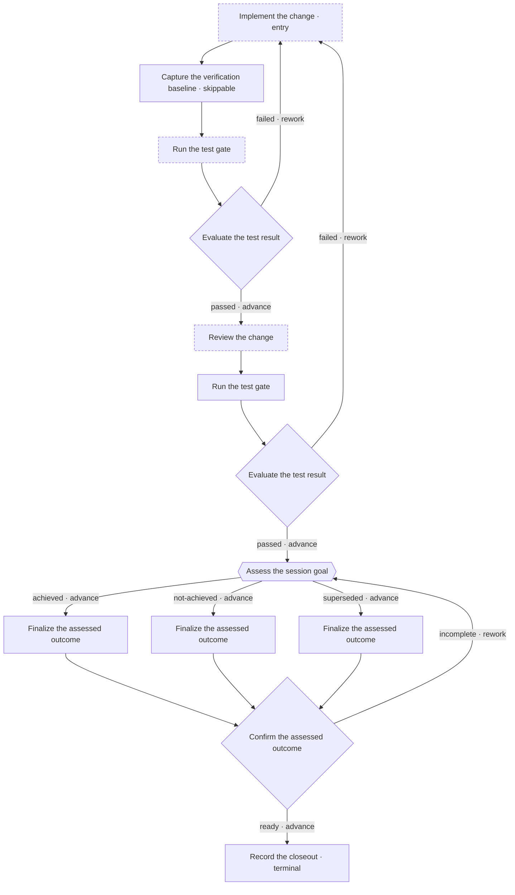

# Podway v2 Full-Feature GA: Goal-Directed Workflow Memory

## Status and authority

- Document state: `Historical`
- Dossier type: release program
- Owning release program: `PV2GA`
- Owning roadmap epics: `V2CTR`, `V2MOD`, `V2AUT`, `V2GRF`, `V2PLT`, `V2RUN`,
  `V2DRW`, `V2GOL`, `V2DOG`, and `V2REL`
- Target product release: `v0.2.0`
- Contract target: `podway.procedure/v2`
- Implementation status: Published as the immutable v0.2.0 GA release on August 12, 2026; all PV2GA roadmap tasks are complete
- Compatibility: `podway.procedure/v1` remains supported with unchanged semantics
- Repository scope: Podway only; Dolgorae changes require separate authorization
- Last accepted planning baseline: August 4, 2026

## 1. Purpose

Podway v1 is an evidence-gated, linearly ordered procedure tracker with retry,
return, and reopen behavior. It answers:

1. Which procedure governs the current task?
2. Which stage is active?
3. Which required items are missing?
4. Which procedural action is allowed next?
5. Which reached stages must be repeated after rework?

That model is intentionally small and deterministic. It does not express a
normal workflow in which evidence or review results select one of several
declared paths.

Podway v2 adds a constrained workflow graph with distinct action and decision
nodes and optional session-goal tracking. It is intended to answer three
additional questions:

1. Why is the current work or decision necessary for the task goal?
2. Which declared path was selected, using which evidence and reason?
3. Which goal revision and success criteria did the actor assess, with what
   recorded outcome?

Podway v2 is an evidence-gated, goal-directed workflow memory and decision
process tracker. It is designed for humans, AI agents, and integrating systems
to externalize the current goal, work, evidence, and decisions without adding
an embedded LLM. External actors continue to perform work, interpret evidence,
assess success criteria, and select decision options. Podway validates the
declared graph, enforces procedural gates, preserves provenance, rejects stale
evidence references, and records the resulting claims and path.

## 2. Compatibility and Delivery Boundary

Podway v2 is a new procedure model. It MUST NOT change the meaning of an
existing v1 procedure or session.

- `podway.procedure/v1` remains a linear ordered-stage contract.
- V1 `complete`, `skip`, `retry`, `return`, `reopen`, and
  `rework.allow_return_to` retain their current behavior.
- A v1 session continues under its immutable v1 procedure snapshot.
- A v2 session starts only from a validated `podway.procedure/v2` document.
- V1 procedures are not automatically converted to v2.
- A future conversion tool MAY produce a candidate v2 file, but the candidate
  MUST be reviewed, vetted, and digest-confirmed as a new procedure.
- Shipping or designing v2 MUST NOT delay or weaken completion and maintenance
  of the v0.1 product boundary.

This adopted release dossier is the decision-complete implementation plan for
the unfinished `PV2GA` release program and its ten owning roadmap epics. The
[active roadmap](../roadmap/) alone owns epic dependencies, task order, and task
status. Accepted ADRs, canonical machine assets, specifications, and implemented
behavior retain their higher authority; each roadmap task promotes its completed
behavior into those sources. Podway is not a source of truth for whether an
external claim is factually or semantically correct. This dossier does not claim
that the described commands, schemas, storage, or behavior are implemented.

### 2.1 Governance decisions

This design is governed by:

- [ADR-0018](../architecture-decision-records/0018-v2-success-envelope.md),
  which assigns Procedure v2 successes to `podway.output/v2`, retains
  `podway.error/v1` for failures, and gives v2 job lookup and status/wait their
  closed v2 wrappers;
- [ADR-0017](../architecture-decision-records/0017-single-cursor-convergence.md),
  which supersedes ADR-0015 and transitively ADR-0002 to permit convergence
  reached by one cursor while preserving one active attempt and rejecting
  parallel or synchronizing joins;
- [ADR-0016](../architecture-decision-records/0016-recorded-item-workflow-memory.md),
  which extends ADR-0007 to recognize decision records and goal
  assessments as new session-scoped record kinds, and to record durably the
  data-flow decision of §8.6 — the selected recorded-item model and the
  rejected typed-output alternative; this extension is explicitly not a
  general evidence ledger: it adds no issuers, no revocation, and no
  cross-session lifetime;
- [ADR-0009](../architecture-decision-records/0009-artifact-metadata-only.md)
  unchanged: item and artifact metadata semantics carry over, and
  evidence snapshots digest recorded values and never file contents;
- roadmap registration under the repository's ADR, roadmap, and TODO
  conventions.

Per the repository's documentation precedence, the roadmap owns epic
dependencies, task status, and task ordering. Section 19 maps each roadmap task to its deliverable,
acceptance boundary, and focused verification without maintaining a competing
status table. The plan fixes storage migration and v1-session preservation,
the `make test` development gate, the `make dist` release gate, and the
Dolgorae schema-pin, adapter, and handoff sequence (§2.2).

### 2.2 Integration notices

- the Dolgorae adapter MUST be notified of a completed session's reactivation
  to running through `goal revise --reactivate`, and of the contract-surface
  delta (§16);
- downstream vendored schema pins, including Dolgorae's, update per release.

## 3. Product Boundaries

### 3.1 Required properties

Podway v2 MUST:

- retain one current task session per worktree;
- retain exactly one active node attempt per running session;
- use a single authoritative cursor;
- keep procedure definitions declarative and data-only;
- allow reusable node definitions;
- give every graph placement a unique identity;
- support action and decision nodes;
- optionally track a versioned session goal, success criteria, and assessments;
- support declared normal advance and rework routes;
- support a separately identified manual rework escape hatch;
- record evidence as exact references to prior valid attempts and their
  recorded values;
- preserve historical attempts for the lifetime of the current session;
- fail closed on stale, ambiguous, invalid, or unsupported state;
- expose stable machine-readable diagnostics and runtime projections;
- keep authoritative task state local to the worktree.

### 3.2 Explicit non-goals

Podway v2 MUST NOT become:

- a parallel-stage DAG scheduler;
- a BPMN engine;
- an arbitrary finite-state-machine framework;
- a shell, build, test, or CI runner;
- an expression or plugin runtime;
- an AI agent runtime;
- an automatic judge of semantic correctness;
- a multi-user authorization service;
- a cryptographic identity or approval system;
- a remote workflow service;
- a long-term audit, compliance, or artifact archive.

The graph may contain branches, joins reached by a single cursor, and cycles.
It does not contain concurrent tokens, parallel node attempts, forks that
execute simultaneously, or joins that wait for multiple active branches.
Podway imposes no semantic limit on attempts, retries, rework transitions, or
cycle traversals. The external actor decides when to continue, rework, or
cancel; Podway does not infer that a workflow has run for too long. Downstream
of a join, only placements that dominate the consuming placement may back a
required evidence reference (§11.3); evidence from a branch-specific
placement is representable only as an optional evidence reference (§8).

## 4. Identity Model

Podway v2 separates reusable behavior, graph placement, and runtime execution.

```text
Node Definition
  -> reusable action or decision contract

Graph Node
  -> one uniquely identified placement of a Node Definition

Node Attempt
  -> one runtime execution of a Graph Node
```

### 4.1 Procedure identity

A procedure has:

- `schema`: exact value `podway.procedure/v2`;
- `id`: stable author-defined procedure identifier;
- `version`: author-defined procedure version;
- `name`: display name;
- `purpose`: the general outcome the procedure is intended to protect;
- `description`: optional explanatory text;
- an immutable canonical representation and SHA-256 digest after admission.

### 4.2 Node definition identity

`node_definition_id` identifies a reusable node contract. A definition owns
intrinsic behavior such as:

- node type;
- title and description;
- action instructions and item contracts;
- decision objective, prompt, evidence guidance, options, and reason policy;
- an optional session-goal assessment contract.

A node definition does not identify a location in the graph. It MUST NOT be
used as a route or manual rework target.

### 4.3 Graph node identity

`graph_node_id` identifies one placement of a node definition in the procedure
graph. A graph node owns contextual wiring such as:

- the referenced node definition;
- the placement's `evidence_from` wiring;
- an action node's next target, terminal disposition, or skip policy;
- a decision node's option routes;
- transition effects;

Every `graph_node_id` MUST be unique within a procedure graph. The same node
definition MAY be placed multiple times under different graph node IDs.

All normal routes and manual rework targets use `graph_node_id`.

### 4.4 Attempt identity

`attempt_id` identifies one runtime attempt of one graph node. Attempts also
have a monotonically increasing attempt number scoped to their graph node, and
receive a session-scoped, monotonically increasing trace sequence number at
activation (§9).

Attempt identity is used for:

- optimistic concurrency;
- resolved evidence reference snapshots;
- stale-reference detection;
- mutation idempotency;
- runtime history and attribution.

An attempt ID is not a graph routing identity. Rework never reactivates an old
attempt. It creates a fresh attempt for the selected graph node.

Each attempt also records the session goal revision that was current when the
attempt was activated, or an explicit null value when no session goal had yet
been defined. Defining the first goal revision binds it to the current active
attempt without rewriting older terminal attempts.

### 4.5 Session goal identity

Session goal tracking is procedure-controlled and optional. When enabled, the
current session may own immutable, monotonically numbered goal revisions. Each
revision contains:

- a concrete task-specific goal statement;
- one or more stable-ID success criteria;
- the reason for a revision after the first;
- optional caller-supplied actor attribution;
- creation time and the preceding revision identity.

Every revision records its binding trace sequence: `goal define` uses the active
attempt it binds, while `goal revise` uses the fresh target attempt activated by
that transaction. Goal assessment records carry the trace sequence of their
decision attempt. These correlations make both record families pageable with
the verbose history cursor without making either record part of the execution
trace itself.

Every goal field is bounded: the goal statement at 1,000 characters, each
criterion identifier at 64 and each criterion statement at 300 characters,
each revision reason at 1,000 characters, each criterion assessment reason
at 2,000 characters, and a revision holds at most 16 criteria. These bounds
make the static arithmetic of §10.4 and §11.3 well founded for
goal-assessment sources and for the goal display block.

A procedure purpose is reusable author guidance. A session goal is the
task-specific desired outcome. An action intent explains local work. A decision
objective explains a local choice. These concepts MUST NOT be treated as
interchangeable identities.

## 5. Procedure v2 Authoring Model

The normative authoring format is YAML. JSON MAY be accepted as an equivalent
machine-authored input. Both formats resolve to the same canonical semantic
model and digest.

The following example illustrates the intended shape. The machine schema is
the final authority for field spelling and closed-object validation; the
numeric bounds are fixed by §5.1 and the schema restates them.

The example demonstrates:

- reusable definitions placed more than once (`test-gate`, `evaluate-test`,
  `finalize-outcome`);
- graph node IDs that never collide with node definition IDs;
- the same decision definition placed twice with different `evidence_from`
  wiring;
- a skippable placement (`capture-baseline`) that only an optional evidence
  reference may consult;
- an action placement (`review-change`) using `evidence_from` as pure
  read-back;
- evidence item selectors (`assess-session-goal` and `confirm-closeout`
  read back only `review-summary` from `review-change`);
- a join (`confirm-closeout`) entered by three normal advance transitions,
  whose required references name common dominators — including a
  session-goal assessment decision whose record reads back — and whose three
  branch-specific references are optional, with exactly one resolving per
  traversal;
- declared rework routes to two different dominating targets;
- session goal tracking with a final assessment before the terminal action.

```yaml
schema: podway.procedure/v2
id: software-change
version: "2"
name: Verified software change
purpose: Deliver a reviewed change with fresh verification evidence.

goal_tracking: true

node_definitions:
  implementation:
    type: action
    title: Implement the change
    intent: Produce an implementation that satisfies the task goal.
    instructions:
      - Implement only the agreed scope.
      - Record the resulting source revision.
    items:
      - id: implementation-summary
        type: text
        prompt: Summarize the implemented change.
        required: true
      - id: source-revision
        type: text
        prompt: Record the resulting source revision.
        required: true

  baseline:
    type: action
    title: Capture the verification baseline
    intent: Record the environment used to interpret later test evidence.
    instructions:
      - Record the toolchain and environment used for verification.
    items:
      - id: environment-fingerprint
        type: text
        prompt: Record the verification environment fingerprint.
        required: true

  test-gate:
    type: action
    title: Run the test gate
    intent: Produce fresh verification evidence for the current change.
    instructions:
      - Run the required test command outside Podway.
      - Record the command, its exit status, and the log digest.
    items:
      - id: test-command
        type: text
        prompt: Record the exact test command that was run.
        required: true
      - id: test-exit-status
        type: integer
        prompt: Record the exit status of the test command.
        required: true
      - id: log-digest
        type: text
        prompt: Record the digest of the captured test log.
        required: true

  evaluate-test:
    type: decision
    title: Evaluate the test result
    objective: Only a change supported by acceptable test evidence may proceed.
    prompt: Is the recorded test result acceptable for the task goal?
    evidence_guidance:
      - Read the recorded test command, exit status, and log digest.
      - Compare against the captured verification baseline when one exists.
    options:
      - id: passed
        label: Tests passed
        criteria: The recorded test run completed successfully.
      - id: failed
        label: Tests failed
        criteria: The recorded test run did not complete successfully.
    reason:
      required: true
      prompt: Explain the selection using the referenced evidence.

  review-work:
    type: action
    title: Review the change
    intent: Review the verified candidate against the task goal.
    instructions:
      - Review the implementation and its verification evidence.
      - Record the review summary and any findings.
    items:
      - id: review-summary
        type: text
        prompt: Summarize the review result.
        required: true
      - id: review-findings
        type: list
        prompt: List unresolved review findings, if any.
        required: false

  assess-goal:
    type: decision
    title: Assess the session goal
    objective: Record whether the current goal revision is supported by fresh evidence.
    prompt: What is the outcome of the current session goal?
    evidence_guidance:
      - Read the latest recorded test command, exit status, and log digest.
      - Read the recorded review summary and findings.
    items:
      - id: assessment-note
        type: text
        prompt: Record observations supporting the criterion assessments.
        required: false
    options:
      - id: achieved
        label: Goal achieved
      - id: not-achieved
        label: Goal not achieved
      - id: superseded
        label: Goal superseded
    assessment:
      target: session_goal
      outcomes:
        achieved: achieved
        not-achieved: not_achieved
        superseded: superseded
    reason:
      required: true
      prompt: Explain the outcome using the criterion results and evidence.

  finalize-outcome:
    type: action
    title: Finalize the assessed outcome
    intent: Record the outcome note and follow-up for the assessed goal.
    items:
      - id: outcome-note
        type: text
        prompt: Record the outcome note and any follow-up commitments.
        required: true

  confirm-outcome:
    type: decision
    title: Confirm the assessed outcome
    objective: Only a task whose recorded outcome is consistent may close.
    prompt: Is the recorded outcome ready for final closeout?
    evidence_guidance:
      - Compare the outcome note with the recorded goal assessment.
      - Confirm follow-up commitments exist when the goal was not achieved.
    options:
      - id: ready
        label: Ready to close
        criteria: The outcome record is consistent with the assessment.
      - id: incomplete
        label: Outcome record incomplete
        criteria: The outcome record is missing or contradicts the assessment.
    reason:
      required: true
      prompt: Explain the selection using the referenced evidence.

  closeout:
    type: action
    title: Record the closeout
    intent: Produce the final task closeout.
    items:
      - id: closeout-note
        type: text
        prompt: Record the final closeout.
        required: true

graph:
  entry: implement

  nodes:
    - id: implement
      use: implementation
      next: capture-baseline

    - id: capture-baseline
      use: baseline
      skip:
        allowed: true
        reason_required: true
      next: test-after-impl

    - id: test-after-impl
      use: test-gate
      next: decide-after-impl-test

    - id: decide-after-impl-test
      use: evaluate-test
      evidence_from:
        - node: test-after-impl
          required: true
        # a skippable source may back only an optional reference
        - node: capture-baseline
          required: false
      routes:
        passed:
          to: review-change
          effect: advance
        failed:
          to: implement
          effect: rework

    - id: review-change
      use: review-work
      # action read-back: the reviewer receives the implementation summary
      # and the recorded test result through `next` (§6.2, §8.4)
      evidence_from:
        - node: implement
          required: true
        - node: test-after-impl
          required: true
      next: test-after-review

    - id: test-after-review
      use: test-gate
      next: decide-after-review-test

    - id: decide-after-review-test
      use: evaluate-test
      evidence_from:
        - node: test-after-review
          required: true
      routes:
        passed:
          to: assess-session-goal
          effect: advance
        failed:
          to: implement
          effect: rework

    - id: assess-session-goal
      use: assess-goal
      evidence_from:
        - node: test-after-review
          required: true
        - node: review-change
          required: true
          # selector keeps the assessment's read-back within budget
          items:
            - review-summary
      routes:
        achieved:
          to: finish-achieved
          effect: advance
        not-achieved:
          to: finish-not-achieved
          effect: advance
        superseded:
          to: finish-superseded
          effect: advance

    - id: finish-achieved
      use: finalize-outcome
      next: confirm-closeout

    - id: finish-not-achieved
      use: finalize-outcome
      next: confirm-closeout

    - id: finish-superseded
      use: finalize-outcome
      next: confirm-closeout

    - id: confirm-closeout
      use: confirm-outcome
      evidence_from:
        # required references at a join name common dominators; the
        # assessment reference reads back the goal assessment record (§8.4)
        - node: assess-session-goal
          required: true
        - node: review-change
          required: true
          # selector: only the summary reads back, not the findings list
          items:
            - review-summary
        # branch-specific outcome notes: exactly one resolves per traversal
        - node: finish-achieved
          required: false
        - node: finish-not-achieved
          required: false
        - node: finish-superseded
          required: false
      routes:
        ready:
          to: record-closeout
          effect: advance
        incomplete:
          to: assess-session-goal
          effect: rework

    - id: record-closeout
      use: closeout
      terminal: true

manual_rework:
  allowed_targets:
    - implement
    - test-after-impl
    - review-change
```

### 5.1 Closed and bounded definitions

All v2 procedure objects MUST reject unknown fields. Hard limits are part of
this design rather than deferred to the schema; the machine schema restates
them and MUST NOT relax them. The v2 authoring bounds are:

| Bound | Value |
|---|---|
| every identifier (procedure, definition, node, item, option, criterion) | 64 characters |
| procedure `version` | 1 to 64 characters |
| procedure `name` / `purpose` / `description` | 120 / 500 / 1,000 characters |
| source document input / canonical source projection / nesting depth / parsed nodes | 1,048,576 bytes / `SOURCE_PROJECTION_MAX_CHARACTERS` = 131,072 characters / 64 / 100,000 |
| graph nodes per procedure | 64 |
| node definitions per procedure | 64 |
| definition `title` / `intent` / `description` | 120 / 300 / 1,000 characters |
| decision `objective` / `prompt` / reason-policy `prompt` | 300 / 500 / 300 characters |
| instructions per definition | 16, each at most 1,000 characters |
| items per definition | 64 |
| item prompt / item help | 300 / 1,000 characters |
| text item `max_length` | default 4,000; hard maximum 16,384 |
| list item | default 50 entries of 500; hard maximum 200 entries of 1,000 characters |
| choice item | at most 32 choices, each at most 120 characters |
| `evidence_from` entries per placement | 8 |
| selected items per `evidence_from` entry | 16 |
| options per decision definition | 8 |
| option label / option criteria | 120 / 500 characters |
| `evidence_guidance` | 8 entries, each at most 200 characters |

Where a v1 bound is larger — a 65,536-character text value, 4,000-character
list entries, 1,024 open blockers — the v2 bound deliberately replaces it
for v2 procedures and sessions; v1 sessions keep every v1 bound unchanged.
These numbers exist so that the wire-size budget of §10.4 is provable
arithmetic. They cap each field individually; the §10.4 budgets cap their
combination, so a definition that drives every bound to its ceiling at once
is rejected at vet rather than admitted.

Schema shape decisions are fixed as follows:

- action definitions require non-empty `title` and `intent`;
- an option's only optional descriptive field is `criteria`;
- a declared `reason` policy requires `required: true`; `false` is invalid;
- a declared action-placement `skip` policy requires `allowed: true`; `false`
  is invalid;
- graph placements have no display override fields;
- empty optional collections are omitted rather than written explicitly.

Procedure files MUST NOT:

- execute commands;
- define arbitrary expressions;
- load plugins;
- use remote includes;
- configure network endpoints;
- read secrets;
- mutate Git;
- identify files outside the worktree.

## 6. Node Contracts

### 6.1 Common node behavior

Action and decision nodes share:

- a graph placement;
- one active attempt when current;
- attempt-local item values and blockers where permitted;
- start and end timestamps;
- immutable terminal attempt history;
- validity state separate from terminal lifecycle;
- optimistic revision preconditions.

Only one node attempt may be active across the session.

An attempt's recorded item values are its only durable work record. Item
values are attempt-local while the attempt is active and immutable once the
attempt is terminal. Items use the v1 typed item contracts: `confirm`,
`text`, `choice`, `integer`, `list`, and `artifact`, under the v2 bounds of
§5.1. Artifact items retain metadata-only semantics; Podway records artifact
identity and metadata, never artifact bytes.

A v2 attempt holds at most 64 open blockers, each with a reason of at most
1,000 characters; v1 sessions keep the v1 limits unchanged. These bounds
feed the blocker window of §10.4.

Any placement MAY read prior recorded state through evidence references
(§8). A decision placement consumes its resolved references as decision
evidence; an action placement consumes them as pure read-back, so that the
actor receives the referenced prior state through the normal `next` contract
instead of reconstructing it from conversation history. Neither node type
declares typed input contracts; instructions and items carry the complete
work contract, as v1 stages do.

### 6.2 Action nodes

An action node represents work performed outside Podway.

An action definition MUST contain:

- `title`;
- `intent`;

It MAY additionally contain:

- `description`;
- `instructions`;
- typed required and optional items.

An action definition declares work and its recorded items only. Evidence
wiring belongs to placements, never to definitions (§8).

An action graph node has exactly one normal outcome:

- `next: <graph_node_id>`; or
- `terminal: true`.

It MUST NOT declare both or neither.

An action graph node MAY declare `evidence_from` (§8.1). For an action
placement, resolved references gate nothing: `complete` does not re-verify
their freshness, and no readiness condition depends on them. They exist so
that `next` presents the referenced prior recorded state to the actor
(§8.4). Declaration, resolution, and vet rules are identical to a decision
placement's.

`podway complete` on an action node succeeds only when:

- every required item is satisfied;
- no blocker is open;
- the session, active graph node, and attempt preconditions match;
- for a terminal action with goal tracking enabled, the fresh final goal
  assessment required by §7.5 exists.

Completing a non-terminal action atomically completes the active attempt and
activates a fresh attempt of its declared next graph node.

Completing a terminal action atomically completes the attempt and session.

An action graph node MAY additionally declare a skip policy on the placement:

```yaml
- id: capture-baseline
  use: baseline
  skip:
    allowed: true
    reason_required: true
  next: test-after-impl
```

Skip is a placement policy, not a definition property. A declared `skip`
object states both fields explicitly; a placement without one cannot be
skipped. Decision placements MUST NOT declare `skip`, and the schema rejects
it: skipping a decision would leave routing undefined.

`podway skip --reason <text>`:

- is allowed only for the active attempt of an action placement whose skip
  policy allows skipping;
- fails without a non-empty reason when `reason_required` is true;
- completes the attempt with lifecycle `skipped`;
- ignores unmet item requirements;
- records no item values on the skipped attempt;
- advances exactly as `complete` would, to the declared next graph node or
  terminal disposition.

Skipping a terminal action is subject to the same terminal readiness gates as
completing it, including the fresh final goal assessment when goal tracking
is enabled (§7.5). Skip never bypasses a terminal gate. A skipped terminal
action completes the session exactly as a completed one does.

A skipped attempt may back only an optional evidence reference, which then
resolves with `skipped: true` and an empty item set (§8.2). Vet MUST reject a
procedure in which any placement referenced by a `required: true`
`evidence_from` entry declares `skip.allowed: true`, with the stable code
`SKIPPABLE_EVIDENCE_SOURCE` (§11.3).

Podway does not perform the action described by the node. An external actor
runs commands, edits files, reviews work, and records the results as item
values.

### 6.3 Decision nodes

A decision node represents an explicit selection among declared options.

A decision definition contains:

- `objective`: what the decision is intended to protect or optimize;
- `prompt`: the question presented to the decision-maker;
- optional `evidence_guidance`: short, non-executable strings telling the
  decision-maker what to consult;
- one or more options;
- a reason policy;
- optional decision-local item definitions;
- an optional session-goal assessment contract.

`evidence_guidance` belongs to the reusable definition. It MUST NOT name
graph nodes, and Podway never evaluates it.

Each option contains:

- a stable option ID unique within the definition;
- a human-readable label;
- optional non-executable `criteria`.

Criteria are guidance for the external decision-maker. They are not executable
conditions and are not evaluated by Podway.

All decision nodes support general evidence-informed branching. A decision does
not assess the session goal merely because its objective or prompt mentions the
goal. Only a decision definition with `assessment.target: session_goal` creates
a goal assessment in addition to its ordinary decision record and route.

A decision graph node maps every option to exactly one route and MAY declare
`evidence_from`, the placement-owned list of source placements whose recorded
item values inform the decision (§8.1). Two placements of the same decision
definition MAY declare different `evidence_from` lists. A placement that
declares none is guided by `evidence_guidance` and its decision-local items
alone.

When a decision attempt is activated, every `evidence_from` entry is resolved
exactly once and persisted with the attempt (§8.2). Resolution is never
repeated in place; only a fresh attempt of the placement resolves again
(§8.3).

`podway decide --option <id> --reason <text>` succeeds only when:

- the active node is a decision node;
- the selected option exists in the active definition;
- the active placement declares a route for that option;
- every required evidence reference is resolved and fresh (§8.3);
- every resolved optional reference is fresh; an unresolved optional
  reference does not block the decision;
- every required decision-local item was persisted before `decide`;
- the reason satisfies the definition's reason policy;
- no blocker is open;
- all identity and revision preconditions match.

Decision-local items MUST be stored before `decide`. They MUST NOT be smuggled
into the decision mutation as an unversioned atomic side payload. The reason is
part of the decision event and is recorded atomically with the selection.

### 6.4 Decision records

Every successful decision creates an immutable record containing:

- session ID and session revision;
- procedure snapshot and digest;
- graph node ID;
- node definition ID;
- decision attempt ID and number;
- the goal revision current for the decision attempt, or explicit null;
- selected option ID;
- resolved route target and transition effect;
- reason;
- every declared evidence reference exactly as resolved: source graph node
  ID, source attempt ID and number, `items_digest`, and explicit skipped and
  unresolved markers (§8.2);
- optional caller-supplied actor attribution;
- decision timestamp.

Every string a record carries is bounded: option identifiers by the
identifier rules (64 characters); decision, retry, rework, and skip reasons
at 2,000 characters; criterion assessment reasons at 2,000 characters
(§4.5); and caller-supplied actor attribution at 256 characters. Record
read-back therefore has a computable worst case (§10.4, §11.3).

A decision record MUST remain fully reportable and interpretable for the
lifetime of the current session, even after its decision attempt or a
referenced source attempt becomes stale. Staleness controls whether an
attempt or reference satisfies current requirements; it never hides, edits,
or reinterprets what a historical record reports.

The record states what was selected and which recorded evidence was
referenced. It does not prove that the selected option was semantically
correct or that the attributed actor had external authority.

## 7. Session Goal Tracking

### 7.1 Procedure opt-in

Session goal tracking is enabled only when a procedure declares exactly:

```yaml
goal_tracking: true
```

`goal_tracking` is a scalar boolean opt-in. The only accepted value is `true`.
Validation MUST reject any other value, including `false`, a string, a list, or
a nested policy object. Absence of the key is the only way to disable goal
tracking, and a procedure that omits it disables every session-goal mutation
and imposes no assessment requirement.

When goal tracking is enabled, a fresh final session-goal assessment is always
required before a terminal action may complete (§7.5). There is no setting that
relaxes, downgrades, or narrows that requirement, and no per-placement override.

A procedure without `goal_tracking` retains the complete action and general
decision graph model. Goal tracking is a v2 capability, not a condition for
using decision nodes.

An opted-in session MAY start before its first goal revision is defined. This
allows an initial action node to clarify the task goal. The current goal and its
criteria MUST exist before a session-goal assessment decision can become ready,
and a fresh final assessment MUST exist before a terminal action can complete.

### 7.2 Goal definition and revision

A caller may define revision 1 during admission:

```bash
podway start \
  --procedure workflow.yaml \
  --expect-procedure-digest sha256:... \
  --task "implement cancellation support" \
  --goal "Cancellation is deterministic and safely recoverable." \
  --criterion deterministic="Repeated requests have one outcome." \
  --criterion recoverable="Restart preserves the acknowledged outcome."
```

Alternatively, a running opted-in session with no goal may create revision 1:

```bash
podway goal define \
  --goal "Cancellation is deterministic and safely recoverable." \
  --criterion deterministic="Repeated requests have one outcome." \
  --criterion recoverable="Restart preserves the acknowledged outcome."
```

`--criterion` is repeatable. Its value is `<criterion-id>=<statement>`, split at
the first `=`. Criterion IDs use the same stable kebab-case identifier rules as
procedure items. A goal definition requires a non-empty goal and at least one
criterion. Supplying criteria without a goal is invalid.

Every define or revise request supplies the complete criterion set for the new
revision. Criteria are never copied implicitly from an earlier revision.
Reusing a criterion ID expresses author-attributed continuity, but the new
criterion still belongs to the new immutable goal revision.

Revision 1 is immutable after creation. Defining it during a running attempt
binds that active attempt to the new revision but does not rewrite older
terminal attempts or invalidate the existing trace.

Changing an existing goal creates a new immutable revision and requires an
explicit rework target:

```bash
podway goal revise \
  --goal "Cancellation is deterministic across daemon restart." \
  --criterion deterministic="Repeated requests have one outcome." \
  --criterion restart-safe="Daemon restart preserves the acknowledged outcome." \
  --rework-to implement \
  --reason "The requirement now includes daemon restart."
```

Goal revision:

- is allowed for a running or completed opted-in v2 session;
- is forbidden for a cancelled session;
- requires `--rework-to <graph-node-id>` to name a graph node listed in
  `manual_rework.allowed_targets` (§9.5);
- requires the target graph node to have a valid attempt on the current valid
  execution trace;
- requires the target to be revision-safe: every path from the target to any
  terminal action in the dominance graph (§11.3) passes through at least one
  session-goal assessment decision, so a fresh assessment for the new
  revision necessarily lies ahead on the surviving path; a target that is not
  revision-safe is rejected with a stable error (§16) and no revision is
  created;
- requires `--reactivate` when the session is completed;
- requires exact session, active-attempt when running, and current-goal-revision
  preconditions;
- atomically creates the new goal revision, applies conservative suffix
  invalidation (§9.6) from the selected graph node, and activates a fresh target
  attempt bound to the new revision;
- records the `completed` to `running` lifecycle transition when the session was
  reactivated;
- never mutates or deletes an earlier goal revision or assessment.

Goal revision reworks the graph, so its target obeys the same declared policy as
manual rework rather than a separate allowance. A target that is valid on the
trace but absent from `manual_rework.allowed_targets` MUST be rejected with a
stable error (§16). A procedure that declares no manual rework targets therefore
cannot revise its goal after start; that is a deliberate authoring choice, and
lint reports it (§11.4).

Revision safety is computed from the immutable snapshot's dominance graph.
A path from the target includes the target itself, so a target that is a
session-goal assessment decision is revision-safe through its own placement.
Podway rejects an unsafe target at revise time; vet still accepts the
procedure, because the same target remains legitimate for plain manual rework,
and lint reports every manual rework target of an opted-in procedure that is
not revision-safe so the author knows which targets goal revision can actually
use (§11.4).

Revising a completed session MUST additionally supply `--reactivate`. Without
it the request fails with a stable error and changes no state. The flag is an
explicit acknowledgement that the session lifecycle returns from `completed` to
`running`; the transition, its reason, and the new goal revision are recorded
together in one mutation. For a running session the flag is unnecessary and MUST
NOT change behavior. Reactivation through goal revision is otherwise governed by
the manual rework rules of §9.5. A cancelled session cannot revise and cannot be
reactivated by this command.

The caller identifies the earliest work affected by the changed goal. Podway
validates the target and invalidates the suffix; it does not judge whether the
caller selected the semantically ideal target.

### 7.3 Criterion assessment state

Only the active attempt of a decision with `assessment.target: session_goal`
may store criterion assessment state. Before `decide`, the caller records one
result for every criterion in the current goal revision:

```bash
podway goal assess-criterion deterministic \
  --status satisfied \
  --reason "The recorded test run covers the repeated-request scenarios." \
  --evidence test-after-review \
  --item assessment-note
```

Criterion assessment state is attempt-local, revision-checked, and discarded
when the attempt is retried or made stale. Supported statuses are:

- `satisfied`: the actor claims the criterion is supported;
- `unsatisfied`: the actor claims the criterion is not satisfied;
- `not_applicable`: the actor claims the criterion no longer applies because
  the current goal is being superseded.

Statuses are homogeneous within one assessment-decision attempt. The first
recorded criterion result fixes that attempt's mode:

- applicability mode: `not_applicable` only; the supersession path;
- assessment mode: `satisfied` or `unsatisfied` only.

Recording a result of the other mode MUST fail with the stable code
`CRITERION_MODE_MIXED` and MUST NOT change stored state. Switching modes
requires `podway retry` (§9.4), which abandons the attempt, creates a fresh one,
and clears the attempt-local criterion state. A caller therefore cannot assemble
a complete criterion set that no declared outcome accepts.

A criterion result MAY cite recorded state:

- `--evidence <graph-node-id>` cites a resolved evidence reference of the active
  decision attempt, named by its source graph node ID (§8.2);
- `--item <item-id>` cites a decision-local item persisted on the active
  attempt.

Both flags are repeatable and MAY be combined, up to four citations per
criterion result in total. Citation is OPTIONAL: a criterion may have no
citable recorded state, and Podway MUST NOT invent or infer one. The reason
is ALWAYS required, for every status. A citation MUST name a reference
resolved by the active decision attempt or an item persisted on that attempt;
anything else fails with a stable error (§16). `not_applicable` requires a
reason and MUST NOT cite evidence through either flag, because a superseded
criterion makes no supported claim.

Podway validates identity, freshness, mode, citation target, and shape. It does
not validate the semantic truth of a criterion result or the relevance of the
cited state.

### 7.4 Goal-assessment decisions

A goal-assessment decision is an ordinary decision with this additional
definition contract:

```yaml
assessment:
  target: session_goal
  outcomes:
    achieved-option: achieved
    failed-option: not_achieved
    superseded-option: superseded
```

Every option in such a decision maps to exactly one goal outcome, and every
one of the three goal outcomes MUST be mapped by at least one option. Vet
rejects a goal-assessment definition that leaves an option unmapped or an
outcome unreachable (§11.3), so a determined outcome always has a selectable
option. The decision retains ordinary evidence, reason, option route, and
transition-effect behavior. General decision nodes omit `assessment` and never
create a goal outcome.

`podway decide` on a goal-assessment decision additionally requires:

- a current goal revision matching the attempt's bound goal revision;
- one persisted criterion result for every criterion in that revision;
- `achieved` only in assessment mode with every criterion `satisfied`;
- `not_achieved` only in assessment mode with every criterion assessed and at
  least one `unsatisfied`;
- `superseded` only in applicability mode with every criterion `not_applicable`.

Under the homogeneous mode rule of §7.3 a complete criterion set always
determines exactly one of these outcomes, and outcome coverage guarantees that
outcome has an option and a route, so the allowed-outcome set of a complete
assessment attempt can no longer be empty and the former mixed-state dead end
is structurally unreachable. `podway next` MUST therefore always surface at
least one legal continuation on a goal-assessment decision: a
`goal assess-criterion` shape for each unassessed criterion while the set is
incomplete; the `decide` option for the determined outcome once the set is
complete; and `retry` at any time, which clears the attempt-local criterion
state so the actor may assess in the other mode. The structured guidance
obligations for these shapes are normative in §10.1.

The successful mutation atomically creates the ordinary decision record (§6.4)
and an immutable goal assessment record. The goal assessment contains the goal
revision, overall outcome, criterion results with their statuses, reasons, and
citations, the attempt's resolved evidence references, actor attribution,
decision identity, and timestamp. Evidence references in the assessment record
are the slim resolved references of §8: source graph node ID, source attempt ID
and number, `items_digest`, and the explicit skipped or unresolved flag. They
are stored exactly as resolved, and the record remains reportable for the
session lifetime even after its attempt or its source attempts become stale.

### 7.5 Final assessment and lifecycle

For an opted-in procedure, vet MUST prove that every terminal action is
dominated by at least one session-goal assessment decision, using the single
dominance definition of §11.3.

Runtime completion of a terminal action also requires a valid, fresh goal
assessment for the current goal revision on the current valid execution trace.
A goal assessment is fresh only when:

- its assessment decision attempt is still `valid` on the current valid
  execution trace;
- its bound goal revision is the current goal revision.

Because invalidation is conservative trace-suffix invalidation (§9.6), an
assessment attempt that remains valid necessarily retains fresh resolved
references: staling a source attempt stales every later valid attempt,
including the assessment that referenced it.

A goal revision that reworked to a target lying after every assessment
decision would leave the prior assessment valid but bound to a superseded
revision, with no reachable assessment decision to record a fresh one. The
revision-safety requirement of §7.2 makes that state unreachable.

Skipping a terminal action is subject to the same gate as completing it (§6.2);
skip never bypasses the final assessment. Declared rework (§9.3), manual rework
(§9.5), or goal revision (§7.2) that stales the assessment removes terminal
readiness until a new assessment is recorded on the new trace suffix.

The session lifecycle and goal outcome are separate. A procedure may terminate
normally with `achieved`, `not_achieved`, or `superseded`; `completed` means the
declared workflow reached a valid terminal action, not that Podway certified the
goal as achieved.

## 8. Evidence References and Read-Back

Evidence references are the only declared cross-placement data flow in v2. A
placement — action or decision — names earlier placements whose recorded
values inform its work. Activation resolves each entry to one exact source
attempt, and read-back presents that attempt's recorded values to the actor.
For a decision placement the resolved references are the decision's evidence
and gate `decide` (§6.3); for an action placement they are pure read-back and
gate nothing (§6.2). A placement's recorded values become consultable by a
later placement only through such a reference.

### 8.1 Declaration

A decision definition MAY declare `evidence_guidance`: a bounded list of
short, non-executable strings that tell the decision-maker what to consult.
Definitions are reusable, so guidance MUST NOT name graph nodes.

Any graph node MAY declare `evidence_from`:

```yaml
evidence_from:
  - node: test-after-impl
    required: true
    items:
      - test-exit-status
      - log-digest
  - node: capture-baseline
    required: false
```

Each entry:

- names one source placement by graph node ID;
- is required unless it declares `required: false`;
- MAY declare `items`, a non-empty list of item IDs from the source
  definition selecting what reads back; an entry without `items` selects
  every item of the source definition;
- identifies a placement, never a node definition and never a specific
  attempt.

Selectors bound presentation, not identity: `items_digest` is always
computed over the source attempt's complete recorded item values (§8.2), and
the decision record snapshots the reference as resolved regardless of
selection. Vet rejects a selector naming an item the source definition does
not declare, and enforces the aggregate read-back budget over the selected
items (§11.3).

Vet enforces the declaration statically (§11.3): every entry MUST name an
existing graph node other than its own placement; every required source MUST
strictly dominate its consuming placement, so a placement never references
itself; and no required source may declare `skip.allowed: true` (§6.2). A
source that only some paths reach, such as a branch-specific placement or
one branch into a join, is therefore representable only as an optional
reference. This is a deliberate expressiveness limit (§3.2).

### 8.2 Resolution at activation

When an attempt of a placement that declares `evidence_from` is activated,
every declared entry is resolved exactly once and persisted with that
attempt. Resolution binds the entry to the source placement's current valid
attempt on the current valid execution trace (§9).

A resolved reference persists at least:

- the source graph node ID;
- the source attempt ID and attempt number;
- the resolution timestamp;
- `items_digest`: the SHA-256 digest of the canonical JSON of the source
  attempt's complete recorded item values — all recorded items, regardless
  of any selector (§8.1).

A resolved source attempt is always terminal, so its recorded item values are
immutable and `items_digest` is stable for the life of the reference.

A required reference MUST resolve. Vet guarantees that every required source
strictly dominates its consumer (§11.3), so the source placement has exactly
one valid terminal attempt on the trace whenever the consuming placement
activates. If the store ever violates that guarantee, domain validation MUST
fail closed with an integrity error; Podway MUST NOT guess, skip the entry,
or select a fallback attempt.

An optional reference MAY be unresolved when its source placement has no
valid attempt on the current valid execution trace, for example a branch that
was not taken or a join reached from another branch. An unresolved optional
reference is persisted explicitly as unresolved. It is not an error, and it
never blocks readiness, `complete`, or `decide`.

A skipped source attempt can back only an optional reference (§6.2). The
resolved reference then records `skipped: true` and an empty item set.

### 8.3 Freshness and staleness

A resolved reference is fresh while its source attempt remains valid on the
current valid execution trace.

`podway decide` MUST verify the freshness of every resolved reference at
decision time and MUST fail with a stable machine-readable error when any
reference went stale, for example under concurrent rework. Podway MUST NOT
silently re-resolve a stale reference to a newer source attempt.

Conservative trace-suffix invalidation (§9.6) is the sole staleness mechanism
for references:

- when rework or goal revision stales a trace suffix, every consuming
  attempt in that suffix becomes stale together with its resolved
  references;
- a subsequent fresh attempt of the same placement resolves its references
  again at activation;
- persisted resolution state is never edited in place.

Stale references and stale attempts remain inspectable history, and the
decision records that snapshot them remain reportable (§6.4). Staleness only
prevents them from satisfying current readiness, decision, or terminal
requirements.

### 8.4 Read-back views

`podway next` on a node whose placement declares `evidence_from` MUST
present, for every resolved reference:

- the source node title and source graph node ID;
- the source attempt number;
- the source attempt's recorded values for the selected items (§8.1),
  subject to the §5.1 item value bounds.

When the source attempt belongs to a decision placement, read-back
additionally presents that attempt's immutable decision record — the
selected option and reason — and, when the source is a session-goal
assessment decision, its goal assessment record with the recorded outcome
and criterion results (§6.4, §7.4). A record is part of what the source
attempt produced; referencing the placement is how a later placement
consumes it. Record read-back is not selectable: `items:` selectors filter
item values only, and a decision source always charges the §6.4 record
worst case against the read-back budget (§10.4, §11.3).

The actor reads prior recorded state back from Podway instead of inferring
it from conversation history, scrollback, or external notes.

Read-back distinguishes reference states explicitly:

- a skipped source reads back as skipped with no item values, never as
  recorded work;
- an unresolved optional reference reads back as unresolved, never as an
  empty result;
- a stale reference reads back as stale in historical and verbose views; an
  active attempt holding a stale reference is an integrity fault, because
  staling a source stales every later attempt including the consumer (§8.2,
  §9.6).

Aggregate read-back is bounded at authoring time: vet computes the
worst-case encoded size of every placement's read-back from the selected
items' type bounds and rejects a placement that exceeds `READBACK_BUDGET`
(524,288 bytes; §10.4, §11.3). Read-back is one component of the complete
wire-size budget of §10.4; that whole-envelope arithmetic — not this
subsection alone — proves that every reachable `next` result encodes within
the IPC frame, and only on the strength of that proof is a runtime
serialization failure on a vetted procedure an integrity fault rather than
an expected overflow path.

Read-back belongs to `next` alone: status projections at every tier carry
reference metadata and never read-back values (§10.4). Decision records
replay the same resolved snapshot for the session lifetime (§6.4).

### 8.5 Trust boundary

Podway verifies reference identity, resolution, freshness, and the digest of
recorded item values, and it replays decision and goal-assessment records
exactly as recorded (§6.4). It does not prove:

- that an external command was actually executed;
- that a recorded exit status, log digest, or item value honestly describes
  what happened;
- that a referenced artifact or recorded value is semantically relevant;
- that a review was competent;
- that a human or AI interpreted the referenced evidence correctly.

`items_digest` identifies recorded item values under the canonical hashing
contract. It digests what the actor recorded, never file contents or external
system state, and it does not prove authorship. Because the digest spans the
source attempt's complete recorded values, a reference attests to values a
selector did not present to the consuming actor (§8.1); selection narrows
what was shown, never what is attested.

Integrations may provide stronger evidence capture or authorization, but that
authority remains outside Podway.

### 8.6 Design decision: recorded items, not typed outputs

An earlier draft of this design bound typed producer outputs to consumers:
output slots with schema identifiers, output revisions, and content digests,
wired through per-placement input and evidence bindings. The recorded-item
model is the accepted design. ADR-0016 records the selected model and the
rejected typed-output alternative as the durable architectural authority.

The comparison the decision weighed:

- Machine-checkable producer/consumer compatibility. The typed model checks
  that a producer's declared output schema identifier equals the consumer's
  declared input schema identifier. Podway never interprets external schema
  definitions, so that check is a declaration of intent verified only as
  opaque identifier equality, not a verified type contract — but what the
  declaration bought was authoring-time detection of a mis-wired pair, such
  as a review result plugged into a slot expecting a test result. The item
  model drops the declaration deliberately and detects mis-wiring only
  structurally, through vet's checks that referenced placements and
  selected item IDs exist (§11.3); item contracts type each recorded value,
  `items_digest` identifies what was recorded, and semantic fit is the
  actor's judgment (§8.5).
- Per-consumer selection and data minimization. The typed model flows only
  declared slots. The item model recovers the presentation side of this
  axis through evidence item selectors (§8.1): a reference names exactly
  the items it reads back, and vet bounds the aggregate (§11.3).
  Attestation still spans the source attempt's complete recorded values
  (§8.5), so selection narrows what is shown, not what is attested.
- Formal gating versus informational read-back. The typed model gates
  completion on producing declared outputs. The item model keeps an
  equivalent completion gate — required items must be satisfied before an
  attempt completes (§6.2) — and gates decisions on required-reference
  resolution, decision-local items, and reasons (§6.3), while action-side
  references stay informational (§6.2). What neither model can buy is
  narrower invalidation: conservative suffix invalidation (§9.6) reworks
  positionally regardless of how data flow is declared.
- Schema, storage, migration, and authoring cost. The typed model adds an
  output value model, output mutation surfaces, output canonicalization,
  and per-placement binding wiring. The item model reuses the v1 item
  machinery unchanged and adds only references and selectors.
- Payload consequences. Typed slots are small by construction. Item
  read-back is bounded by selectors and the vet-enforced budgets, and it is
  one component of the whole-envelope wire-size arithmetic that proves
  frame safety at authoring time (§10.4).

Typed producer outputs and a general evidence ledger are outside the v2 scope.

## 9. Graph and Transition Semantics

This section defines how the single cursor moves through the declared graph and
which attempts may satisfy the current path. §9.7 defines the execution trace,
attempt lifecycle, and attempt validity; earlier subsections use those terms as
defined there.

### 9.1 Entry and terminal behavior

Every graph has exactly one entry graph node. Starting a session activates the
entry graph node's first attempt.

Every reachable graph node MUST have at least one finite route to a terminal
outcome. This is an existence property, not a promise that an actor will select
that route. A terminal action uses `terminal: true`. A future terminal decision
disposition MAY be added only through an explicit schema decision; v2 initially
terminates through an action node.

### 9.2 Advance routes and the cycle rule

A normal forward transition completes the current attempt and activates a fresh
attempt of the target graph node. It never changes the validity of any earlier
attempt.

Two placements declare it:

- an action graph node declares exactly one `next` target or `terminal: true`
  (§6.2);
- a decision route declares `effect: advance` (§6.3).

Both are advance edges. A graph node MAY be the target of more than one advance
edge. Such a join is reached by the single cursor along exactly one incoming
edge per traversal and never waits for another branch (§3.2).

Cycles are governed by exactly one rule:

```text
every cycle in the procedure graph
  MUST contain at least one `effect: rework` edge
```

The following are corollaries of that rule and of the node contracts in §6.
They are consequences of it, not additional constraints:

- only a decision route may carry `effect: rework`, because an action graph
  node declares no transition effect;
- an action graph node has exactly one successor, so an action can never close
  a cycle by choosing among alternatives;
- the subgraph formed by all advance edges is therefore acyclic;
- an action-only cycle and an advance-only cycle are both impossible;
- every traversal of every cycle passes through at least one decision, so every
  loop in the execution trace has a decision record that explains it.

Vet enforces the corollaries derivatively (§11.3). It MAY report an action-only
cycle or an advance-created cycle under its own diagnostic code, but each such
rejection is an instance of the single rule above and MUST NOT be read as an
independent requirement.

### 9.3 Declared rework routes

`effect: rework` is a normal, procedure-authored loop. It represents an
expected outcome such as a failed verification returning to implementation.

Vet proves that a declared rework route's target dominates the decision
placement that routes to it (§11.3). The target therefore always has exactly
one valid attempt on the current valid execution trace when the route is
selected, and "target not on the valid trace" is not a runtime failure mode for
a declared route. A stored state that contradicts the proof is an integrity
fault and MUST fail closed rather than be repaired by guessing.

Selecting an option whose route declares `effect: rework` atomically:

1. completes the decision attempt and writes its immutable decision record;
2. marks the target graph node's prior valid attempt stale;
3. marks every later valid attempt stale, including the routing decision's own
   attempt just completed in step 1;
4. marks every resolved evidence reference held by those attempts stale;
5. appends a fresh attempt for the target graph node with a new trace sequence
   number;
6. makes that new attempt the sole active attempt.

Step 3 is not an exception to the suffix rule; it is a consequence of it. The
routing decision's attempt was activated later than the target's prior attempt,
so it lies inside the invalidated suffix and becomes `completed` and `stale` in
the same transaction that recorded it. This is the normal shape of a declared
loop: the decision that caused the rework cannot itself satisfy the path it
just discarded.

Staleness gates requirement satisfaction, not history. The decision record
written in step 1 remains fully reportable and interpretable for the session
lifetime, together with its resolved evidence references, exactly as required
by §6.4, regardless of the validity of its own attempt or of the source
attempts it references. Earlier attempts likewise remain inspectable history
with their trace sequence numbers and recorded item values intact. They do not
satisfy the new path.

### 9.4 Retry

`podway retry --reason <text>` repeats the current graph node without selecting
a different graph placement.

Retry:

- abandons the current active attempt and marks it stale in the same
  transaction;
- appends a fresh attempt for the same graph node with a new trace sequence
  number;
- starts that attempt with no recorded item values and no open blockers;
- clears criterion assessment state when the placement is a decision, and
  resolves every declared `evidence_from` entry again at activation, for
  action and decision placements alike (§8);
- preserves the abandoned attempt as history;
- does not reactivate an earlier attempt and does not copy any value from one.

Retry changes the validity of no other attempt. The current valid execution
trace continues with the fresh attempt in place of the abandoned one.

Retry applies to both action and decision nodes unless a later node-type policy
explicitly restricts it.

### 9.5 Manual rework and reactivation

Manual rework is an exceptional escape hatch for an unexpected finding,
requirement change, or correction not represented by a normal decision route.
It is not a hidden normal transition.

The procedure declares:

```yaml
manual_rework:
  allowed_targets:
    - implement
    - test-after-impl
    - review-change
```

Targets are graph node IDs, not node definition IDs or attempt IDs.

The command is:

```bash
podway rework --to <graph-node-id> --reason <text>
```

Manual rework:

- is allowed only for a declared target;
- requires the target graph node to have a valid attempt on the current valid
  execution trace;
- requires an exact current session revision;
- requires the active attempt precondition when the session is running;
- may reactivate a completed v2 session;
- is not allowed for a cancelled session;
- applies the same conservative suffix invalidation as a declared rework route
  (§9.6);
- appends a fresh target attempt;
- records that the transition was manual rather than graph-selected.

The caller chooses a manual rework target at runtime, so vet cannot prove that
it dominates the point of use. Unlike §9.3, the target-on-trace precondition is
therefore a genuine runtime check with a stable error (§16), not an integrity
assertion.

The caller does not select an old attempt. Old attempts are historical. The
graph node ID identifies the placement to be performed again.

Reactivation of a completed session is governed by exactly these rules:

- the v1 `reopen` command does not exist in v2, and a v2 command MUST NOT be
  given `reopen` semantics;
- a completed v2 session returns to `running` through exactly two paths:
  `podway rework --to <graph-node-id>` for a declared manual rework target, and
  `podway goal revise --reactivate` for an opted-in session (§7.2);
- both paths invalidate the trace suffix, append a fresh target attempt, and
  record the lifecycle transition back to `running`;
- because a `goal revise --rework-to` target MUST also satisfy
  `manual_rework.allowed_targets` (§7.2), a procedure that declares no manual
  rework targets has no reactivation path at all;
- such a procedure is terminal by design: once a terminal action completes, the
  session can only be inspected or reset;
- terminal by design is a legal authoring choice, not an error. Lint warns
  `NO_REACTIVATION_PATH` so that the author confirms it was intended (§11.4).

### 9.6 Conservative invalidation

V2 uses conservative trace-suffix invalidation. It is the only mechanism in v2
that changes the validity of an attempt.

For a rework target `N`:

```text
valid attempt of N
  + every later valid attempt
  -> stale

fresh attempt of N
  -> active
```

The same rule serves declared rework routes (§9.3), manual rework (§9.5), and
goal revision (§7.2); retry (§9.4) applies its degenerate case, a suffix of
exactly one attempt — the one being abandoned. It is preferred over attempting
minimal dependency invalidation. Exact causal references still matter: they
keep stale recorded state from being reused and make the reason for
invalidation inspectable.

Invalidation changes validity and nothing else:

- recorded item values are never mutated, redacted, or deleted by invalidation;
  a staled attempt keeps its trace sequence number, lifecycle, reason, and
  recorded values;
- every resolved evidence reference held by a staled attempt becomes stale with
  it, including its persisted source attempt identity and `items_digest`;
- a resolved reference whose source attempt was staled is stale even when the
  consuming attempt is itself outside the computed suffix;
- a consuming attempt never repairs a stale reference in place. Only a fresh
  attempt activated after the invalidation resolves its declared `evidence_from`
  entries again, against the new current valid execution trace (§8).

Every decision, completion, criterion assessment, or recorded value that
depends on a stale producer is stale even if an inconsistent store snapshot
would otherwise place it outside the computed suffix. Domain validation and
integrity checks MUST fail closed on such a state.

### 9.7 Execution trace, lifecycle, and validity

Every attempt receives a session-scoped, monotonically increasing trace
sequence number when it is activated. Activation also binds the attempt to the
goal revision current at that moment, or to an explicit null (§4.4). Sequence
numbers are assigned exactly once and are never reassigned.

The execution trace is the append-only sequence of every attempt created in the
session, ordered by trace sequence number. Activation appends. No transition
renumbers an attempt, deletes an attempt, or inserts an attempt between
existing sequence numbers.

Attempt lifecycle and attempt validity are separate concepts.

Lifecycle describes what happened:

- `active`;
- `completed`;
- `skipped`;
- `abandoned`.

An attempt whose lifecycle is `completed`, `skipped`, or `abandoned` is a
terminal attempt, and `active` is the only non-terminal lifecycle. This
document uses "terminal attempt" only in that lifecycle sense; the graph
disposition `terminal: true` names a terminal action placement instead (§6.2).

Validity describes whether the attempt may satisfy the current execution path:

- `valid`;
- `stale`.

The following invariants hold in every committed state:

- at most one attempt in the session has lifecycle `active`;
- an attempt with lifecycle `abandoned` has validity `stale`, because retry
  abandons and stales it in one transaction (§9.4);
- validity moves in one direction only; a stale attempt never becomes valid
  again;
- every graph node has at most one valid attempt: a node's first activation
  always arrives through an advance edge, because declared rework, manual
  rework, and goal revision all require their target to already hold a valid
  attempt on the trace (§9.3, §9.5, §7.2), so as a node sequence the current
  valid execution trace is a path in the acyclic advance subgraph (§9.2) and
  its length never exceeds the procedure's graph-node count.

The current valid execution trace is the subsequence of the execution trace
containing exactly those attempts whose validity is `valid`, in trace-sequence
order. This document uses that term verbatim wherever the current path matters.

- While the session is running, the last member of the current valid execution
  trace is the single active attempt.
- After a terminal action completes or is skipped, the last member is that
  terminal attempt and the session has no active attempt.
- As a sequence of graph nodes, the current valid execution trace is a path
  from the entry graph node in the graph analysed by vet. §11.3 states and
  argues the preservation lemma on which required-evidence dominance depends.
- A stale attempt is not on the current valid execution trace. It keeps its
  trace sequence number, lifecycle, reason, and recorded item values, and
  remains inspectable for the lifetime of the session.

Staleness gates requirement satisfaction only. It never renumbers, rewrites, or
deletes history, and it never suppresses a recorded decision or goal assessment
from reporting (§6.4).

The following trace shows one declared-rework cycle in the graph of §5, taken
at the moment the second `decide-after-impl-test` attempt is active. Sequence
numbers are session-scoped; attempt numbers are scoped to their graph node.

| Seq | Graph node | Attempt | Lifecycle | Validity |
|---|---|---|---|---|
| 1 | `implement` | #1 | completed | stale |
| 2 | `capture-baseline` | #1 | skipped | stale |
| 3 | `test-after-impl` | #1 | completed | stale |
| 4 | `decide-after-impl-test` | #1 | completed | stale |
| 5 | `implement` | #2 | completed | valid |
| 6 | `capture-baseline` | #2 | completed | valid |
| 7 | `test-after-impl` | #2 | completed | valid |
| 8 | `decide-after-impl-test` | #2 | active | valid |

Sequences 1 through 4 were all valid until the attempt at sequence 4 selected
the `failed` option, whose route declares `effect: rework` to `implement`. That
one transaction completed the decision attempt with its record, staled the
target's prior valid attempt at sequence 1 and every later valid attempt, and
appended a fresh `implement` attempt at sequence 5. Sequences 2 through 4 are
therefore stale, and sequence 4 is stale as the routing decision's own attempt.
The skipped attempt at sequence 2 participates in the trace and in staleness
exactly like a completed one (§6.2).

After the traversal shown above:

- the execution trace still holds sequences 1 through 8, unchanged and
  unrenumbered;
- the current valid execution trace is sequences 5 through 8, ending in the
  active attempt, and visits each graph node at most once;
- `implement` has two attempts, #1 stale and #2 valid;
- the decision attempt at sequence 8 resolved both of its declared
  `evidence_from` entries at activation (§8.2): the required reference to
  `test-after-impl` attempt #2 at sequence 7, not to the stale attempt #1 at
  sequence 3, and the optional reference to `capture-baseline` attempt #2 at
  sequence 6; had the actor skipped the baseline again, that optional
  reference would instead have resolved with `skipped: true` and an empty
  item set;
- the decision record written at sequence 4 remains reportable and
  interpretable even though its attempt is stale (§6.4).

Had the route targeted a later placement instead, only that placement's prior
valid attempt and the attempts after it would have become stale; every earlier
valid attempt would have remained on the current valid execution trace. A
second traversal of the same cycle appends sequences 9 and beyond. Cycle
traversal always appends and never reuses a sequence number.

### 9.8 Execution liveness and limits

Procedure documents, graph size, individual values, and mutation payloads are
bounded for parser and resource safety. Runtime traversal count is not.

Podway MUST NOT impose a semantic maximum on attempts per graph node, retries,
declared rework transitions, manual rework transitions, goal revisions, trace
length, or cycle traversals. It MUST NOT automatically cancel, complete, or
redirect a session because a count or elapsed duration appears excessive.

A graph may therefore execute indefinitely even though every reachable node has
a possible terminal route. The external human, AI agent, or integration is
responsible for deciding when to retry, continue, rework, cancel, or reset.
Operational failures such as exhausted storage fail closed with stable errors;
they do not become workflow policy or an implicit attempt limit.

### 9.9 Trace exposure and counters

Unbounded execution MUST NOT produce an unbounded projection. Trace semantics
and trace exposure are separate concerns: §9.8 governs what Podway allows, and
this subsection governs what Podway emits.

- The full execution trace, stale attempt history, stale goal revisions, and
  stale goal assessments are verbose-view content only. Verbose views carry a
  bounded trace window with explicit truncation fields (§10.1).
- Compact status MUST NOT carry the full execution trace, stale attempt
  history, or evidence read-back values. `next` MUST carry read-back values
  for the active attempt's resolved references (§8) and MUST NOT carry the
  full execution trace or stale attempt history.
- Compact status MUST carry, for each graph node, its attempt count and its
  rework-traversal counter — the number of times the graph node has been the
  target of a declared rework, manual rework, or goal-revision transition —
  and MUST carry the session-scoped `trace_length`.
- These counters are bounded by the graph-node count regardless of how long
  a session runs, and §10.4's counters component and compact-status
  definition prove that a compact projection stays inside its cap no matter
  how many cycles were traversed.

The counters are the self-limiting signal for external actors. An agent or
integration that wants a traversal budget reads `trace_length`, the per-node
attempt counts, and the rework-traversal counters, and applies its own policy
outside Podway. Podway reports the counts; it never derives a limit from them,
and a counter crossing any threshold is not a Podway error.

## 10. Runtime Views and Commands

### 10.1 Status and next

Status projections come in three tiers — compact, standard, and verbose —
and `next` is a fourth, single-form view budgeted by §10.4. Each facet below
names its lowest tier: a `[compact]` facet appears in every status tier, a
`[standard]` facet in standard and verbose status, and a `[verbose]` facet
only in verbose status. This tiering is the §10.4 wire-size design applied
to the view contract; compact status follows the same discipline as the v1
compact projection, which already omits prompts, instructions, and values.

Status projections MUST distinguish:

- procedure schema and digest `[compact]`;
- procedure purpose and goal-tracking policy `[standard]`;
- the current goal revision number and latest valid goal outcome
  `[compact]`;
- the goal display block — statement, criteria, and per-criterion
  assessment status, never assessment reasons (§10.4) `[standard]`;
- stale historical goal revisions and assessments `[verbose]`;
- node definition ID, graph node ID, and node type `[compact]`;
- active attempt ID and number `[compact]`;
- `trace_length` `[compact]`; the current valid execution trace as entries
  `[verbose]`;
- stale historical attempts `[verbose]`;
- immutable decision records and declared or manual rework records, each
  correlated by execution trace sequence `[verbose]`;
- the active attempt's resolved evidence reference metadata and each
  reference's state — resolved, unresolved, skipped, or stale (§8);
  read-back values belong to `next` alone (§10.4) `[standard]`;
- the count of missing required items `[compact]`; their identifiers
  `[standard]`;
- `blockers_total` `[compact]`; the open-blocker window of §10.4
  `[standard]`;
- the active attempt's recorded item values, display-capped and windowed
  per §10.4 `[standard]`;
- allowed decision option identifiers `[standard]`;
- the declared next action target or terminal disposition, and the placement
  skip policy when one is declared `[standard]`;
- allowed manual rework graph nodes `[standard]`;
- per-graph-node attempt counts and rework-traversal counters `[compact]`
  (§9.9);
- queue and revision state, and readiness booleans `[compact]`.

Machine guidance is normative, not a convenience. Every `podway next` result
MUST carry:

- `allowed_actions`: the stable identifiers of the commands that are legal in
  the current state;
- `suggestions[]`: one entry per legal next mutation, each carrying the
  command, a structured `argv` array in the v1 json-contract shape, and the
  targeted `item_id` where the mutation addresses an item.

An `argv` array is a structured template. Each element is either a literal
argument or a placeholder — an angle-bracketed token such as `<text>`,
`<value>`, or `<reason>` following the v1 json-contract convention — that
names exactly one caller-supplied value. A suggestion whose `argv` contains
no placeholder MUST execute unedited and produce the advertised mutation. A
suggestion with placeholders MUST identify every caller-supplied value
through its placeholders and MUST require no other editing: every literal
element, flag, and ID is final.

The suggestion set MUST cover every legal forward-progress mutation of the
current state:

- one item mutation for each missing required item of the active attempt;
- `complete` when the active attempt belongs to an action placement, every
  required item is satisfied, no blocker is open, and, for a terminal action
  with goal tracking enabled, the fresh final goal assessment of §7.5 exists;
- one `decide` suggestion for every option whose selection is currently
  legal, each carrying that option's literal ID: every routed option of a
  general decision once its required decision-local items are persisted and
  no blocker is open (§6.3); on a session-goal assessment decision, no
  option while the criterion set is incomplete, and only the options mapped
  to the determined outcome once it is complete (§7.4);
- one `goal assess-criterion` suggestion for every criterion of the bound
  goal revision that the active assessment attempt has not yet assessed,
  each carrying that criterion's literal ID;
- `retry`;
- `skip --reason <text>` when the active placement is an action whose skip
  policy allows skipping (§6.2);
- `goal define` when goal tracking is enabled and revision 1 is absent (§7.1).

Manual rework, blocker management, cancellation, and reset are exceptional or
administrative flows. Their legality is carried by `allowed_actions` and, for
manual rework, by the allowed-target list; they do not require per-target
suggestions.

A reachable state in which a legal forward-progress mutation exists but no
suggestion names it is a contract defect, not a presentation choice. An
automation client MUST be able to select a suggestion, substitute exactly its
placeholders with the values only the caller can supply, and obtain the
advertised mutation without consulting prose.

`podway next` on a decision node MUST additionally carry evidence read-back
for every resolved reference of the active attempt exactly as §8.4 requires:
the source graph node ID and title, the source attempt number, that
attempt's recorded values for the selected items (§8.1) within the §5.1
item value bounds, and the decision-record and goal-assessment content
§8.4 requires for decision sources. A skipped source reads back as skipped
and an unresolved optional reference as unresolved, never as recorded work.

Payload bounds apply per projection tier (§10.4):

- compact status inherits the automation-contract envelope cap of 262,144
  UTF-8 bytes unchanged (§16.1) and carries no trace entries, no history,
  no windows, and no read-back values — identifiers, integers, digests,
  and flags only;
- compact status MUST carry, for every graph node, its attempt count and its
  rework-traversal counter, and MUST carry the session-scoped `trace_length`
  (§9.9);
- standard status carries the §10.4 standard tier, including the
  open-blocker window with `blockers_total` and `blockers_truncated`
  whenever entries are omitted, and the values window with
  `items_truncated` and `items_total`;
- verbose views carry the bounded history windows and MUST state each
  window's extent through explicit `trace_truncated` and `trace_window`
  fields; a verbose view MUST NOT silently omit a trace member — whenever
  the window excludes any attempt, `trace_truncated` MUST be true and
  `trace_window` MUST report the trace sequence bounds actually carried;
- `status --verbose --history-before <trace-sequence>` applies one exclusive
  cursor to every history family; entries whose trace sequence is greater than
  or equal to the cursor are omitted, so clients can page a coherent historical
  view without a second public route;
- the complete `next` response is bounded by the wire-size budget of §10.4:
  vet enforces the per-placement components and the remaining components
  are design constants, so a reachable `next` result always encodes within
  the IPC frame.

Because compact status carries identifiers, integers, digests, and flags
only (§10.4), it stays inside its cap however many cycles the session has
traversed. Trace entries appear only in verbose windows; the current valid
execution trace is nonetheless bounded by the graph-node count (§9.7), and
only stale history grows with traversal, confined to the §10.4 windows.

`podway next` on an action node reports the action intent, instructions,
missing required items, the declared next graph node or terminal disposition,
the placement skip policy when one is declared, and, when the placement
declares `evidence_from`, the read-back of §8.4.

`podway next` on a decision node reports the decision objective, prompt,
`evidence_guidance`, the read-back above as its evidence summary, options,
option criteria, and the required reason policy. The exact `podway decide`
call shapes are the `argv` suggestions above, one for each currently legal
option; the view MUST NOT present a decide shape that the suggestion set
omits.

On a goal-assessment decision, `podway next` additionally reports the bound
goal revision, every criterion with its assessment status (status only —
assessment reasons are never echoed in progress views, §10.4), the attempt
mode fixed by the first recorded result when one exists (§7.3), and, once
the criterion set is complete, the determined outcome together with the
options mapped to it (§7.4). The exact `podway goal assess-criterion` call
shapes are likewise the `argv` suggestions. Because outcome coverage
guarantees that the determined outcome has a selectable option, this view
always presents at least one legal continuation.

When goal tracking is enabled but revision 1 is absent, `status` and `next`
report that state explicitly and suggest `podway goal define` without
inventing a goal statement or success criteria.

### 10.2 Command applicability

V2 command applicability includes:

| Command | Active context |
|---|---|
| `complete` | action placement only |
| `decide` | decision placement only |
| `skip` | active action placement whose skip policy allows it |
| `retry` | active action or decision placement |
| `rework` | running or completed v2 session |
| `goal define` | running opted-in v2 session without a goal |
| `goal revise` | running or completed opted-in v2 session with a goal |
| `goal assess-criterion` | active session-goal assessment decision |
| item mutations | active node attempt only |
| `block` / `unblock` | active node attempt |
| `cancel` | running session |
| `reset` | existing session |

`goal revise` on a completed session additionally requires `--reactivate`. The
flag returns the session lifecycle from `completed` to `running`, and that
transition is recorded in the same mutation as the new goal revision (§7.2).

A wrong-verb call fails with a stable machine-readable error and changes no
state. This includes `podway complete` on a decision placement, `podway decide`
on an action placement, `podway skip` on a placement that declares no skip
policy or forbids skipping, and `podway goal assess-criterion` on a decision
that is not a session-goal assessment.

V1-only commands retain v1 meaning. `podway return` MUST NOT be silently
reinterpreted as v2 `rework`.

The v1 `reopen` command does not exist in v2. Returning a completed v2 session
to `running` is exactly `podway rework --to <graph-node-id>` for a declared
manual rework target or `podway goal revise --reactivate` for an opted-in
session (§9.5). Because a goal revision target MUST also satisfy
`manual_rework.allowed_targets` (§7.2), a procedure that declares no manual
rework targets has no reactivation path at all and is terminal by design; lint
warns `NO_REACTIVATION_PATH` so that the author confirms the choice (§11.4).

### 10.3 Concurrency

Every state-changing request remains a durable daemon mutation and carries the
preconditions relevant to what it changes:

- workspace and session identity;
- session revision;
- graph node;
- attempt;
- item;
- goal revision;
- criterion assessment state;
- resolved evidence reference and decision preconditions.

A delayed decision made against attempt A MUST fail if the active cursor has
already moved to attempt B. Podway MUST NOT apply a semantically plausible but
stale option to a newer decision attempt.

A delayed goal assessment made against goal revision A MUST fail after revision
B is created, even if the criterion IDs and selected option still appear
compatible. Podway never silently rebinds an attempt or assessment to a newer
goal revision.

### 10.4 Wire-size budget

The IPC frame bounds every response at 1,048,576 bytes (§16.1). The claim
that every reachable `next` result encodes within that frame is proved by
arithmetic over the complete response, not asserted for one component. This
subsection is that arithmetic; §17.9 makes it executable.

Accounting rule: the wire encoding emits UTF-8 and escapes only
JSON-mandatory characters, so one character encodes to at most 6 bytes (a
control character's `\uXXXX` escape). The budget charges every bounded
string as its character bound times 6, plus 64 bytes of structural overhead
per field and 8 bytes per array element. This rule MAY over-approximate and
MUST NOT under-approximate the production encoding.

The `next` budget:

| Component | Constant | Bytes |
|---|---|---|
| envelope, identities, and protocol metadata | `ENVELOPE_RESERVE` | 65,536 |
| procedure-static content, per placement | `NEXT_STATIC_BUDGET` | 262,144 |
| evidence read-back, per placement | `READBACK_BUDGET` | 524,288 |
| goal display block | `GOAL_DISPLAY_MAX` | 73,728 |
| open-blocker window | `BLOCKER_WINDOW_MAX` | 49,152 |
| counters | `COUNTERS_MAX` | 40,960 |

The components sum to 1,015,808 bytes, leaving 32,768 bytes of headroom
below the 1,048,576-byte frame. Every field of a `next` result belongs to
exactly one component:

- `ENVELOPE_RESERVE`: the direct output envelope or one terminal job
  reconciliation wrapper, workspace, session, job, queue, revision metadata,
  framing overhead — the envelope surface v2 inherits unchanged (§16.1) —
  plus the response identities: procedure schema and digest, node
  definition ID, graph node ID, node type, and the active attempt ID and
  number;
- `NEXT_STATIC_BUDGET`: every field derived from the immutable procedure
  snapshot for the active placement, without exception — node title,
  intent, description, decision objective, prompt, and reason policy,
  instructions, missing-item identifiers and prompts, option identifiers,
  labels, and criteria, `evidence_guidance`, the declared next target or
  terminal disposition, the skip policy, the allowed manual rework
  targets, and the complete `allowed_actions` and snapshot-derived
  `suggestions[].argv` set. Every contributing string is bounded by §5.1,
  and vet charges the whole set (§11.3);
- `READBACK_BUDGET`: resolved evidence read-back — each reference's
  metadata (source title and graph node ID, attempt number,
  `items_digest`, and its resolved, unresolved, skipped, or stale marker)
  charged before its selected item values, and the non-selectable record
  content of decision sources including the record's own resolved
  reference snapshots, its bounded citations, and actor attribution
  (§6.4, §7.3, §8.4);
- `GOAL_DISPLAY_MAX`: the bound goal revision's statement, criterion
  identifiers and statements, per-criterion assessment status, the
  attempt's assessment mode and determined outcome, the latest valid goal
  outcome, and the runtime-derived `goal assess-criterion` and
  `goal define` suggestion argv, whose criterion identifiers exist only in
  session state and are therefore charged here rather than in the static
  component. Progress views echo neither criterion assessment reasons nor
  the revision reason; those live in the records and their read-back
  (§7.3, §8.4). Worst case under §4.5: a 1,000-character statement, 16
  criteria at 64 + 300 characters with fixed status fields, and 16
  suggestion entries — under 66,000 bytes charged, within the component;
- `BLOCKER_WINDOW_MAX`: open blockers, newest first, each carried complete
  and carrying exactly its identifier, reason (at most 1,000 characters),
  and created timestamp, until the next entry would exceed the window;
  `blockers_truncated: true` and `blockers_total` then report the
  remainder as stable machine-readable fields. A v2 attempt holds at most
  64 open blockers (§6.1); each entry charges under 7,000 bytes, so the
  window carries at least 7 complete entries;
- `COUNTERS_MAX`: per-graph-node attempt counts and rework-traversal
  counters for at most 64 graph nodes (§5.1) plus `trace_length` — under
  38,000 bytes charged, within the component.

Vet enforces the two per-placement components with stable codes
(`NEXT_STATIC_BUDGET_EXCEEDED`, `READBACK_BUDGET_EXCEEDED`, §11.3). The
remaining components are constants of this design, closed by the §4.5,
§5.1, and §6.1 bounds together with the deterministic omission rules above.
The table's sum is therefore a static proof that every reachable `next`
result encodes within the frame, and §17.9 requires an executable fixture
that reproduces the proof through the production serialization path and
binds the charged arithmetic to the encoded bytes.

Compact status is defined subtractively: it carries the envelope and
identities, the counters component, `trace_length`, the goal revision
number and latest valid outcome, `blockers_total`, the count of missing
required items, and readiness booleans — identifiers, integers, digests,
and flags only. It carries no prompts, no instructions, no statements, no
suggestion argv, no windows, no read-back, and no trace entries, so it fits
its 262,144-byte cap with the envelope and counters components alone.

Standard status adds, on top of the compact content, the goal display block
(`GOAL_DISPLAY_MAX`), the open-blocker window (`BLOCKER_WINDOW_MAX`), the
active attempt's resolved reference metadata, missing required item
identifiers, allowed option identifiers, the next target and skip policy,
the allowed manual rework targets, the procedure purpose and goal-tracking
policy, and the active attempt's recorded item values — each value rendered
at most 2,048 characters with a per-item `value_truncated` marker, and the
values as a whole windowed at `STATUS_VALUES_MAX` = 262,144 bytes in
declaration order, with `items_truncated` and `items_total` whenever the
window omits any. The full value is never required for a mutation decision
and remains exactly what the actor recorded. Charged worst case: 65,536 +
40,960 + 73,728 + 49,152 + 262,144 plus under 80,000 bytes of identifiers
and static fields — under 580,000 bytes, within the frame.

Read-back belongs to `next` alone: status projections at every tier carry
reference metadata and never read-back values, and `next` has exactly one
form — there is no verbose `next`.

Verbose status adds the history windows: the current valid execution trace,
stale attempts, immutable decision records, declared and manual rework records,
stale goal revisions, and stale goal assessments. Each is a newest-first window
of at most `TRACE_WINDOW_MAX` = 65,536 bytes and its family count cap (32 current trace, 1 stale attempt, 1 decision, 6 rework, 1 stale goal revision, 1 stale goal assessment), with explicit `trace_truncated`
and `trace_window` fields whenever entries are omitted. Every history entry
carries its correlated execution trace sequence so the same exclusive
`--history-before <trace-sequence>` cursor pages all six families. Six windows
add 393,216 bytes to the standard charge — under 980,000 bytes in total and
within the frame. §17.9 requires a verbose maximum-size fixture.

Only because of this whole-envelope arithmetic may a runtime serialization
failure be classified as an integrity fault: it can occur only when an
implementation violated the proof, never as an expected overflow path
(§8.4).

## 11. Procedure Authoring Toolchain

Humans and AI agents author workflows. Podway owns deterministic parsing,
formatting, validation, vetting, diagnostics, canonicalization, and graph
projection.

All authoring commands are local and deterministic. They MUST NOT execute
procedure-defined commands, invoke AI, access the network, or mutate Git.

### 11.1 Format

Commands:

```bash
podway procedure format workflow.yaml
podway procedure format workflow.yaml --check
podway procedure format workflow.yaml --write
```

Required behavior:

- default output goes to stdout;
- `--check` exits nonzero when the source is not in canonical authoring form;
- `--write` updates only the explicitly named procedure file;
- output is deterministic, idempotent, and rejected with `SOURCE_PROJECTION_BUDGET_EXCEEDED` when its complete canonical source projection exceeds `SOURCE_PROJECTION_MAX_CHARACTERS`;
- graph node and option author order is preserved where order is meaningful;
- formatting never changes the canonical semantic digest;
- unknown or invalid fields are reported, not dropped;
- formatting never performs speculative semantic fixes.

The formatter MUST NOT silently discard comments.

Podway v0.2.0 GA delivers stdout, `--check`, and `--write` together. `--write`
is accepted only when the implementation preserves supported comments and
rejects unsupported source constructs without modifying the file. Earlier
development builds MUST reject an unimplemented `--write` flag with the stable
unsupported-capability error (§16).

### 11.2 Validate

Command:

```bash
podway procedure validate workflow.yaml
```

Validation covers closed local structure:

- exact schema;
- parser and nesting limits;
- required fields;
- identifier syntax and uniqueness;
- node definition shapes, covering items, options, the reason policy,
  `evidence_guidance`, and the optional session-goal assessment mapping;
- graph placement shapes, covering an action placement's `next` or `terminal`
  disposition, a decision placement's routes, any placement's `evidence_from`
  entries, and a skip policy on action placements only;
- the `goal_tracking: true` scalar opt-in form (§7.1);
- collection and string bounds, including the complete canonical source projection bound;
- unknown field rejection.

Validation is local and structural. It sees one placement at a time and
therefore cannot decide whether a declared reference is satisfiable on every
path. Validation is necessary but not sufficient for graph safety.

### 11.3 Vet

Command:

```bash
podway procedure vet workflow.yaml
```

Vet performs mandatory graph-wide semantic analysis. Three of its checks rest
on one dominance relation, which this subsection defines once for the whole
document.

The dominance graph is derived from the procedure graph alone:

- its vertices are the graph nodes;
- its edges are every action `next` edge and every decision route edge,
  regardless of transition effect, so an `effect: rework` route is an ordinary
  edge here;
- its root is the entry graph node (§9.1).

`D` dominates `N` when every path from the entry graph node to `N` in that
graph passes through `D`. Every node dominates itself. Rework edges are
included deliberately: excluding them would let vet claim dominance over
paths the cursor can actually take only by ignoring declared loops.

The preservation lemma connects that static relation to runtime state. As a
node sequence, every current valid execution trace is a path from the entry
graph node in this graph (§9.7). Conservative suffix invalidation (§9.6)
preserves that property rather than breaking it: a declared rework route,
manual rework, and goal revision all stale the trace suffix beginning at the
prior valid attempt of a target that is already on the valid trace, then
append a fresh attempt of that same target, so the surviving prefix is still a
path from entry and the appended attempt re-extends it along an edge that was
already traversed; retry replaces an attempt of the current node without
changing the node sequence at all. Therefore "`D` dominates `N`" implies that
`D` has exactly one valid attempt on the current valid execution trace
whenever an attempt of `N` is active, and manual rework and goal revision
never have to be modelled as additional entry points.

Vet uses dominance for exactly three checks: required evidence sources,
declared rework route targets, and goal-assessment dominance of terminal
actions in an opted-in procedure. A manual rework target is selected at
runtime, so vet checks only that it names an existing graph node; its presence
on the current valid execution trace is a runtime precondition (§9.5).

Vet rejects:

- a missing or invalid entry graph node;
- missing node definitions;
- missing route or `next` targets;
- unreachable graph nodes;
- reachable non-terminal regions with no finite terminal path;
- action graph nodes that declare both or neither `next` and `terminal`;
- decision options without exactly one route;
- routes declared for undefined options;
- goal-assessment mappings that leave an option unmapped, map an option to an
  unknown outcome, or leave one of the three goal outcomes unreachable (§7.4);
- session-goal assessment definitions used by a procedure that does not
  declare `goal_tracking: true` (§7.1);
- goal-tracking terminal paths not dominated by a session-goal assessment
  decision (§7.5);
- `evidence_from` entries naming a graph node that does not exist;
- `evidence_from` entries naming their own consuming placement;
- required evidence sources that do not strictly dominate their consuming
  placement, with the stable code
  `EVIDENCE_SOURCE_DOES_NOT_DOMINATE_CONSUMER` (§8.1); self-domination never
  satisfies this check, so a source always completes before its consumer
  activates;
- required evidence sources whose placement declares `skip.allowed: true`,
  with the stable code `SKIPPABLE_EVIDENCE_SOURCE` (§6.2);
- evidence item selectors naming an item the source definition does not
  declare, with the stable code `EVIDENCE_SELECTOR_UNKNOWN_ITEM` (§8.1);
- placements whose worst-case read-back exceeds `READBACK_BUDGET` (524,288
  bytes, §10.4), with the stable code `READBACK_BUDGET_EXCEEDED`: vet
  charges, for every declared entry, the reference metadata (source title
  and IDs, attempt number, `items_digest`, state marker), the selected
  items' type bounds (a text item's `max_length`, a list item's
  `max_items` times `max_item_length`, the fixed encodings of confirm and
  integer, the bounded encodings of choice values, and the bounded
  artifact metadata fields), and — for decision sources — the complete
  record read-back: option identifiers, the §6.4 reason bounds, the
  record's resolved reference snapshots (at most 8), actor attribution,
  and, for goal-assessment sources, the §4.5 goal bounds with at most four
  citations per criterion result (§7.3). All of it is computed under the
  accounting rule of §10.4 (6 bytes per character; never one). Vet sums
  the worst case of every declared entry, resolved or not: it MAY
  over-approximate, and MUST NOT under-approximate;
- placements whose procedure-static `next` content exceeds
  `NEXT_STATIC_BUDGET` (262,144 bytes, §10.4), with the stable code
  `NEXT_STATIC_BUDGET_EXCEEDED`: vet charges every field derived from the
  snapshot for the placement, without exception — title, intent,
  description, decision objective, prompt, and reason policy,
  instructions, missing-item identifiers and prompts, option identifiers,
  labels, and criteria, `evidence_guidance`, the next target or terminal
  disposition, the skip policy, the allowed manual rework targets, and the
  derived `allowed_actions` and suggestion `argv` set — under the same
  accounting rule; an enumeration in an implementation that omits any
  snapshot-derived field under-approximates and is nonconforming;
- `skip` declared on a decision placement, which the schema also rejects
  (§6.2);
- cycles that violate the cycle rule of §9.2;
- declared rework routes whose target does not dominate the routing decision
  placement, with the stable code `REWORK_TARGET_NOT_DOMINATING` (§9.3);
- manual rework targets naming a graph node that does not exist;
- any ambiguous node-definition or graph-placement reference.

An action-only cycle and an advance-only cycle are reported as instances of
the single cycle rule. Vet MAY give them their own diagnostic codes where that
helps the author, but such a rejection MUST NOT be presented as an independent
requirement (§9.2).

Single-cursor exclusivity is not a vet rule. At most one active attempt —
exactly one while the session runs — is a runtime store invariant enforced
under every transition (§17.3), not a property of declared wiring, and no
legal v2 graph can weaken it.

Vetting proves that each reachable node has at least one finite route to a
terminal action. That is terminal-route existence, not runtime termination: it
does not reject a graph because an actor can traverse a valid rework cycle
indefinitely, and it computes no attempt or cycle budget (§9.8).

`podway start` MUST repeat validate and vet against the exact bytes being
admitted. A previous successful check is not sufficient after the file
changes.

### 11.4 Lint

Commands:

```bash
podway procedure lint workflow.yaml
podway procedure lint workflow.yaml --warnings-as-errors
```

Lint reports non-fatal authoring quality issues such as:

- unused node definitions;
- a decision with only one option;
- options with indistinguishable labels or identical effective routes;
- missing or weak purpose, intent, objective, prompt, criteria, or reason
  guidance;
- a decision placement that declares neither `evidence_from` nor
  `evidence_guidance`, so the decision-maker is told nothing about what to
  consult (§8.1);
- an optional evidence reference that no path can ever resolve, because no
  path from the entry graph node to the consuming placement passes through
  the named source placement;
- goal tracking enabled without an early goal-clarification path;
- a goal-assessment decision placed long before every terminal action;
- excessively broad manual rework targets;
- unusually large option sets or cycles;
- duplicated definitions that should be reused;
- graph node IDs that are hard for humans or automation to distinguish;
- legal but confusing rework topology;
- `NO_REACTIVATION_PATH`: `manual_rework.allowed_targets` is absent or empty,
  so a completed session can never be reactivated and the procedure is
  terminal by design (§9.5); when the procedure also declares
  `goal_tracking: true`, the same absence means the session goal can never be
  revised after start (§7.2);
- a manual rework target of an opted-in procedure that is not revision-safe
  (§7.2), so `goal revise --rework-to` that target will be rejected at
  runtime even though plain manual rework remains available;
- a placement referencing more than one session-goal assessment source: two
  such references cannot fit `READBACK_BUDGET` together and vet will reject
  the placement (§10.4, §11.3).

`NO_REACTIVATION_PATH` describes a legal authoring choice. Lint reports it so
that the author confirms the choice was intended, not because the procedure is
invalid.

Lint warnings do not block start by default. Integrations and CI may make them
fatal with `--warnings-as-errors`.

### 11.5 Check

Commands:

```bash
podway procedure check workflow.yaml
podway procedure check workflow.yaml --warnings-as-errors
```

Check is the aggregate authoring gate:

```text
format --check
  -> validate
  -> vet
  -> lint
```

It returns one bounded diagnostic result suitable for humans, CI, and AI
clients.

### 11.6 Stable diagnostics

Every authoring command supports `--json`. Diagnostics include at least:

- stable diagnostic code;
- severity;
- procedure schema;
- source path and bounded location;
- field path;
- node definition ID when applicable;
- graph node ID when applicable;
- related graph node IDs;
- human message;
- bounded remediation hint.

The following example reports the violation that a variant of the §5 procedure
would introduce by marking the `finish-not-achieved` entry of
`confirm-closeout` as `required: true`. That source lies on one of the three
branches entering the join, so it does not dominate the consuming decision:

```json
{
  "code": "EVIDENCE_SOURCE_DOES_NOT_DOMINATE_CONSUMER",
  "severity": "error",
  "schema": "podway.procedure/v2",
  "source_path": "workflow.yaml",
  "location": {
    "line": 87,
    "column": 9,
    "end_line": 87,
    "end_column": 31
  },
  "graph_node_id": "confirm-closeout",
  "field": "graph.nodes[confirm-closeout].evidence_from[finish-not-achieved]",
  "message": "Required evidence is not produced on every path to this node.",
  "related_graph_node_ids": [
    "finish-not-achieved",
    "finish-achieved",
    "finish-superseded"
  ],
  "hint": "Reference a placement that dominates this decision or mark the reference optional."
}
```

Automation branches on codes and structured fields, not prose.

## 12. YAML Authority and Graph Projections

### 12.1 Source hierarchy

The authority hierarchy is:

```text
YAML or JSON source
  -> parsed Procedure v2 model
  -> Canonical JSON/IR
  -> digest and immutable runtime snapshot
```

YAML is the normative human and AI authoring source. Canonical JSON/IR is the
digest, validation, and runtime authority.

Mermaid, PlantUML, DOT, and graph JSON are generated projections. They are
never independent sources of procedure meaning.

### 12.2 Graph command

Commands:

```bash
podway procedure graph workflow.yaml --format mermaid
podway procedure graph workflow.yaml --format puml
podway procedure graph workflow.yaml --format dot
podway procedure graph workflow.yaml --format json
```

Projection requirements:

- deterministic output for the same canonical procedure;
- stable graph node IDs;
- action and decision nodes rendered distinctly;
- session-goal assessment decisions rendered distinctly from general decisions;
- option IDs and transition effects on decision edges;
- entry and terminal nodes visible;
- skippable action placements visibly marked (§6.2);
- manual rework policy visually distinct from normal edges;
- no attempt-local values, secrets, artifact locations, or actor data;
- canonical procedure digest embedded as generated metadata;
- no dependency on a renderer to validate procedure semantics.

An `evidence_from` reference is not a transition. A projection MAY render
evidence references as a distinct non-flow annotation, and MUST NOT draw them
as transition edges: a reader who mistakes an evidence reference for a route
misreads the graph that vet analysed (§11.3) and misjudges what the cursor can
actually do.

Podway generates text projections. It does not need to invoke Mermaid,
PlantUML, Graphviz, a browser, or an image renderer.

Development may sequence the projections internally, with Mermaid preceding
preview, but v0.2.0 GA includes Mermaid, graph JSON, PlantUML, and DOT together.
The requirements above are normative for every format.

### 12.3 Mermaid review projection

Mermaid is the required first-class human review projection because it can be
embedded in Markdown and reviewed without making diagram syntax the procedure
authority.

The following projection is generated from the procedure of §5:



The conventions visible above are:

- a Mermaid node identifier is the graph node ID with separators normalized,
  and a node label is the node definition title, so the three placements of
  `finalize-outcome` share one label under three distinct identifiers and
  placement identity remains the identifier, never the label;
- action placements are rectangles, general decisions are `{"…"}` diamonds,
  and a session-goal assessment decision is a `{{"…"}}` hexagon;
- an action `next` edge is a plain arrow, and a decision route edge carries
  the label `option · effect`, so the three edges labelled with `· rework` are
  exactly the declared rework routes of §5;
- the entry placement, the terminal placement, and the skippable placement
  are annotated in their labels;
- declared manual rework targets are marked by node style rather than by
  edges, because manual rework is a runtime escape hatch and not a declared
  transition (§9.5).

The projection carries transitions only. The `evidence_from` wiring of
`decide-after-impl-test`, `review-change`, `decide-after-review-test`,
`assess-session-goal`, and `confirm-closeout` is deliberately absent from the
flow: it is not a transition, and drawing it as one would misrepresent the
graph (§12.2).

The diagram helps a reviewer understand topology. Full procedure purposes,
session-goal policies, decision objectives, instructions, evidence guidance
and evidence references, reason policies, and bounds remain in the YAML and
canonical model.

Generated diagram text MUST NOT be parsed back as a procedure. Round-tripping
through Mermaid or PlantUML is unsupported.

## 13. Preview and Digest-Bound Plan Confirmation

### 13.1 Review flow

The intended authoring and confirmation flow is:

```text
human or AI authors YAML
  -> Podway formats and checks it
  -> Podway previews it: canonical digest, summary, Mermaid, and the
     fully-formed start command with the digest filled in
  -> reviewer inspects the graph and the detailed procedure
  -> reviewer or integrating authority confirms by starting with that digest
  -> Podway recomputes, compares, and starts an immutable session
```

Custom-procedure starts always carry the reviewed digest explicitly; built-in
preset starts are implicitly confirmed because their digests ship with the
binary (§13.3). Either way, every admission compares the digest of the
semantics it is about to admit against a digest a reviewer or an integration
already saw.

### 13.2 Preview

Commands:

```bash
podway procedure preview workflow.yaml
podway procedure preview workflow.yaml --json
```

Preview includes:

- procedure identity and purpose;
- goal-tracking policy and goal-assessment node summary;
- procedure schema and canonical digest;
- counts of definitions, graph nodes, action nodes, decision nodes, routes,
  cycles, evidence references, skippable placements, and manual rework
  targets;
- validate, vet, and lint results;
- normalized graph summary;
- generated Mermaid;
- the exact start command with the computed digest already filled in, so
  that confirming is one presented command away; in `--json` output it is a
  structured suggestion in the §10.1 shape, and the template rules apply —
  only caller-supplied values such as the task title remain as placeholders.

Preview is read-only, unconditionally. It parses, checks, and reports; it
never creates, mutates, admits, or resumes a session, and it persists
nothing — no digest record, no workspace state, no file. A preview whose
validate or vet step fails still reports its diagnostics; it simply cannot
print a start command, because there is nothing admissible to start.

### 13.3 Confirmation fence

A v2 start binds a session to exactly one reviewed procedure digest. How that
digest is presented depends on where the procedure comes from.

Built-in v2 preset starts are exempt. A preset start uses the existing
`podway start --preset <name>` command shape, and §19.9 delivers the built-in
v2 presets. A preset's canonical digest ships with the binary and was fixed
at release time, so it is implicitly confirmed (§19.9). A preset start MUST
NOT require a confirmation flag, and MUST fail closed if the digest
recomputed from the shipped preset differs from the shipped digest.

A `--procedure <file>` start always requires the exact reviewed digest:

```bash
podway start \
  --procedure workflow.yaml \
  --task "implement cancellation support" \
  --expect-procedure-digest sha256:...
```

Immediately before admission, Podway:

1. reads and parses the procedure under normal path and size protections;
2. validates and vets those exact bytes (§11.3);
3. computes Canonical JSON/IR and its digest;
4. compares the computed digest with `--expect-procedure-digest`;
5. rejects a mismatch, and rejects a custom start without the flag, in
   either case without creating session state;
6. stores the immutable confirmed snapshot when the compared digests are
   equal.

A custom start without the flag fails with the stable code for required
digest confirmation (§16). The caller runs `podway procedure preview`, which
prints the start command with the computed digest filled in (§13.2), and
executes it. Integrations run their own review flow and supply the digest
from it (§2.2, §13.4).

Confirmation states that these canonical semantics were reviewed, not that
these bytes were: the digest is computed over Canonical JSON/IR, so
formatting and comments never affect it.

A reformatted but semantically identical file therefore still matches its
reviewed digest; any semantic change produces a different digest and requires
a new preview or a newly reviewed digest.

Confirmation binds the start to reviewed procedure semantics. It does not
prove who reviewed the procedure or whether the reviewer had organizational
authority.

### 13.4 Integrating authority

In standalone use, Podway records an explicit same-user confirmation and
optional attribution. The confirmation is the explicitly supplied digest for
a custom procedure, or the shipped digest for a built-in preset.

In Dolgorae or another integration:

- the integration determines who may approve a procedure;
- the integration may retain durable authority-bearing approval evidence;
- it supplies the confirmed digest to Podway on the start request;
- Podway enforces the digest fence and records local attribution only.

An AI agent may technically submit a digest under the same-user trust model.
Podway does not claim that this is human approval. Integrations that require a
human gate MUST enforce it outside Podway.

## 14. Storage and Recovery Model

V2 remains relational current state, not event sourcing.

The store must represent at least:

- immutable procedure snapshots with schema and digest;
- immutable session goal revisions and their success criteria;
- graph node placement metadata derived from the snapshot;
- per-graph-node attempt counters;
- session-scoped trace sequence assignment state;
- node attempts with lifecycle, validity, trace sequence, and bound goal
  revision;
- attempt-local items and blockers;
- attempt-local criterion assessment state;
- resolved evidence references and their items_digest values (§8);
- decision records;
- immutable goal assessment records;
- the active graph node and attempt cursor;
- manual and declared rework records;
- session and workspace revisions;
- durable jobs and idempotency state.

The execution trace is append-only for the lifetime of the current session.
Rework changes validity state; it does not delete or rewrite historical
attempts. Goal revision history and goal assessment history are also append-only
until reset.

Reset deletes session-scoped v2 data under the same current-task retention
boundary as v1. Podway does not become a long-term history service.

Storage migrations MUST:

- preserve every retained v1 session exactly;
- preserve every retained v2 snapshot, goal revision, criterion result,
  attempt, evidence reference, decision, goal assessment, validity state, and
  cursor;
- remain transactional and fail closed;
- never infer missing graph or causal state from prose;
- never convert a v1 return history into v2 graph history.

## 15. Trust, Attribution, and Security

Podway remains a same-user local reliability tool.

Actor fields and reasons are attribution:

- they help explain who or what claimed to define a goal, assess a criterion,
  or make a decision;
- they are useful to integrations and current-task history;
- they are not signatures;
- they are not authentication;
- they are not proof of organizational authorization;
- they are not proof of semantic correctness.

Digests identify canonical bytes or metadata under the defined hashing
contract. They do not prove authorship. Evidence snapshots are digests over
recorded item values, not copies of file contents; artifact item metadata
semantics are unchanged.

The daemon continues to:

- use a local Unix-domain socket;
- verify peer UID;
- validate workspace identity;
- serialize writes per worktree;
- enforce revisions and idempotency;
- avoid network access;
- avoid configured command execution;
- avoid artifact byte storage;
- redact content from normal logs.

## 16. Contract and Error Surface

The v2 contract strategy is fixed, not implementer-selectable. Procedure v2
successes use the additive `podway.output/v2` envelope; failures retain
`podway.error/v1`. Both remain open to additive envelope fields. Every v2 surface gets a closed
result schema selected by its own `schema` discriminator, under one naming
rule: a v2 variant of an existing v1 command surface bumps that family's
major version (for example `podway.next-result/v2` for `next` against a v2
session), and a surface with no v1 counterpart starts a new family at `/v1`
(for example a decision result or authoring diagnostics family). V1 sessions
continue to emit the pinned v1 result families byte-for-byte; a v2 session
never emits a v1 result family extended with v2 fields. Every new family and
route registers through §16.1's chain, and a peer that does not support a
family rejects it with the structured compatibility error rather than
ignoring unknown fields. V2 job lookup and status/wait use their `/v2` wrappers
and preserve the complete original v2 success or v1 error terminal envelope.

Versioned surfaces:

- procedure validation and preview;
- graph projection metadata;
- status and next views;
- action completion and skip;
- decisions;
- session goal definition and revision;
- criterion assessment and goal-assessment outcomes;
- manual rework;
- item mutations;
- stale trace and stale evidence-reference failures;
- digest confirmation;
- detached job results.

Older clients and daemons MUST reject a command they register but cannot
serve, and any unsupported result schema, with structured compatibility
errors; a command or route absent from a build altogether produces that
build's ordinary unknown-command or usage error, and the contract manifest
digest identifies which surfaces a build carries (§19). They MUST NOT
ignore unknown v2 fields or silently downgrade a v2 procedure to v1.

The error catalog must distinguish at least:

- invalid v2 schema;
- graph node or definition not found;
- graph node type mismatch;
- route or option not allowed;
- decision reason missing;
- required evidence reference unresolved;
- evidence reference stale, in the `EVIDENCE_REFERENCE_STALE` class (§8.3);
- evidence source unknown at vet;
- required evidence source not dominating its consuming placement at vet,
  `EVIDENCE_SOURCE_DOES_NOT_DOMINATE_CONSUMER` (§8.1, §11.3);
- skippable required evidence source at vet, `SKIPPABLE_EVIDENCE_SOURCE`
  (§6.2);
- evidence item selector naming an unknown item at vet,
  `EVIDENCE_SELECTOR_UNKNOWN_ITEM` (§8.1);
- read-back budget exceeded at vet, `READBACK_BUDGET_EXCEEDED` (§10.4,
  §11.3);
- procedure-static next content over budget at vet,
  `NEXT_STATIC_BUDGET_EXCEEDED` (§10.4, §11.3);
- canonical source projection over `SOURCE_PROJECTION_MAX_CHARACTERS`,
  `SOURCE_PROJECTION_BUDGET_EXCEEDED` (§5.1, §11.1, §11.2);
- rework route target not dominating its routing decision placement at vet,
  `REWORK_TARGET_NOT_DOMINATING` (§9.3);
- goal-assessment outcome mapping with an unmapped option or an unmapped
  outcome at vet (§7.4);
- graph cycle invalid;
- graph has no terminal path;
- manual rework target not allowed;
- manual rework target not on the valid trace;
- goal tracking not enabled;
- session goal missing or already defined;
- goal revision stale;
- goal revision target not allowed by the manual rework policy (§7.2);
- goal revision target not revision-safe (§7.2);
- reactivation flag required;
- criterion mode mixed, `CRITERION_MODE_MIXED` (§7.3);
- criterion citation invalid, naming a reference the active attempt did not
  resolve or an item it did not persist (§7.3);
- criterion result missing or unknown criterion;
- fresh final goal assessment missing;
- procedure digest mismatch;
- digest confirmation required, `DIGEST_CONFIRMATION_REQUIRED` (§13.3);
- stale session or attempt precondition;
- unsupported v2 capability.

That list is a minimum. Every stable error named normatively in §6 through §13
has a catalog entry and registers as §16.1 requires.

Lint findings are authoring-time diagnostics, not runtime errors. Codes such as
`NO_REACTIVATION_PATH` (§9.5, §11.4) surface through the stable authoring
diagnostics contract of §11.6 and MUST NOT be emitted from the runtime error
catalog.

Every error has a stable code, retryability, exit code, and bounded structured
details suitable for automation.

### 16.1 Contract surface delta

The current released baseline is 46 command routes, 29 manifest-bound public
JSON schemas, and 65 error codes. V2 adds exactly these 13 routes:

- `procedure.format`, `procedure.vet`, `procedure.lint`, `procedure.check`,
  `procedure.graph`, `procedure.preview`, `procedure.scaffold`, and
  `procedure.convert`;
- `session.decide` and `session.rework`;
- `goal.define`, `goal.revise`, and `goal.assess_criterion`.

The existing version-aware routes are `procedure.validate`, `session.start`,
`session.start_replace`, `session.status`, `session.next`, `session.complete`,
`session.skip`, `session.retry`, `session.block`, `session.unblock`,
`session.cancel`, and `session.reset`; `item.check`, `item.uncheck`, `item.set`,
`item.add`, `item.remove`, `item.attach`, and `item.clear`; and `job.lookup`,
`job.status`, and `job.wait`; they all reuse their routes under versioned
dispatch. The schema inventory is the exhaustive result-family
set required by §16; the error inventory is the exhaustive stable runtime-error
and authoring-diagnostic set required by §§6–13 and §16. Final counts are derived
contract outputs, not discretionary targets or permission to grow the surface
silently. Every added route, schema family, error code, and diagnostic code MUST
register through:

- the digest-locked contract manifest;
- the known-answer fixtures;
- the product-acceptance matrices;
- the docs verifier;
- the downstream Dolgorae vendored-schema pin, which updates per release
  (§2.2).

V2 inherits the automation-client contract unchanged. It defines no new
automation transport, no new admission mode, and no relaxation of:

- idempotency keys on every state-changing mutation;
- revision preconditions;
- detached admission and job lookup;
- terminal-receipt replay;
- the compact-status envelope cap of 262,144 UTF-8 bytes and the
  1,048,576-byte IPC frame; §10.4 budgets every projection tier against
  these caps.

A v2 command that cannot honor an inherited requirement is a defect in that
command, not an exception to the automation contract.

## 17. Verification and Acceptance

V2 is not accepted merely because one example graph parses. Implementation
acceptance requires evidence across the following areas.

### 17.1 Schema and parser

- YAML and JSON resolve to identical canonical semantics;
- unknown fields, duplicate keys, aliases, tags, includes, oversized values,
  canonical source projections over 131,072 characters, and unsupported constructs fail closed;
- canonical digest is stable across field ordering and formatting;
- v1 and v2 are unambiguously discriminated;
- `goal_tracking: true` is the only accepted opt-in form, and every other
  value, including `false`, a string, a list, or a nested object, is rejected
  (§7.1);
- procedure `purpose`, decision `objective`, `evidence_guidance`,
  `evidence_from`, placement `skip`, and assessment mappings have closed,
  deterministic canonical forms.

### 17.2 Graph vetting

- unique definition and graph placement identities;
- valid entry graph node and a finite terminal route from every reachable
  node;
- unreachable-node detection;
- route completeness, covering both an option without a route and a route for
  an undefined option;
- the single cycle rule of §9.2, with its corollaries reported derivatively
  rather than as independent requirements;
- acceptance of valid rework cycles without attempt or traversal limits;
- dominance analysis, with the preservation lemma of §11.3 exercised as a
  property test over generated graphs and generated valid execution traces;
- every declared rework route's target dominates its routing decision
  placement (`REWORK_TARGET_NOT_DOMINATING`);
- `evidence_from` checks: an unknown source placement, an entry naming its
  own consuming placement, a required source that does not strictly dominate
  its consumer, and a required source that declares `skip.allowed: true`
  (`SKIPPABLE_EVIDENCE_SOURCE`);
- evidence item selector validation and the aggregate read-back budget
  arithmetic, including a maximum-size reachable read-back fixture
  (`READBACK_BUDGET_EXCEEDED`);
- goal-assessment dominance for opted-in terminal paths;
- goal-assessment option and outcome coverage, so that no option is unmapped
  and no outcome is unreachable (§7.4);
- manual rework policy validation;
- deterministic diagnostics.

### 17.3 Runtime

- at most one active attempt across the session, and exactly one while it
  runs, enforced as a store-level invariant rather than inferred from graph
  shape;
- action completion and decision selection enforce different contracts;
- skip honors the placement skip policy and every terminal readiness gate;
- an action placement may declare `evidence_from`; its resolved references
  gate nothing — `complete` does not re-verify their freshness and no
  readiness condition depends on them (§6.2);
- `next` on any placement that declares `evidence_from` carries the
  read-back of §8.4, including decision-record and goal-assessment content
  for decision sources;
- runtime read-back presents exactly the selected items of each reference
  (§8.1), never the unselected remainder;
- delayed or duplicated decisions fail or replay safely;
- declared rework and manual rework create fresh attempts;
- trace-suffix invalidation is complete and atomic, including the routing
  decision's own attempt (§9.3);
- stale resolved evidence references never satisfy readiness or `decide`;
- re-resolution occurs only on a fresh attempt and never in place;
- historical attempts, decision records, and goal assessments remain
  inspectable and reportable while non-satisfying;
- completed-session reactivation through manual rework and
  `goal revise --reactivate` behaves deterministically;
- cancelled sessions cannot reactivate;
- repeated retry and rework traversal remains valid without a count limit;
- storage exhaustion fails atomically rather than becoming an implicit limit.

### 17.4 Goal tracking

- goal tracking is absent and inapplicable for procedures that do not opt in;
- opted-in sessions may define revision 1 at start or during an initial action;
- goal definition requires a statement and at least one stable-ID criterion;
- goal revision atomically records the new revision and reworks the selected
  valid trace suffix, and its target obeys the manual rework policy;
- goal revision targets that are not revision-safe are rejected, so a
  revision can never strand a valid but revision-mismatched assessment with
  no reachable assessment decision (§7.2, §7.5);
- `--reactivate` is required to revise a completed session and is inert for a
  running one; cancelled sessions may not revise;
- delayed mutations against an older goal revision fail;
- general decisions never create goal assessments;
- criterion statuses are homogeneous within one assessment attempt, a mixed
  result fails with `CRITERION_MODE_MIXED`, and only `retry` switches the mode;
- outcome determination matches §7.4, and outcome coverage guarantees that the
  determined outcome has a selectable option and route;
- criterion citations are validated against the attempt's resolved evidence
  references and its persisted decision-local items;
- stale goal assessments never satisfy terminal readiness;
- completed lifecycle and recorded goal outcome remain distinct.

### 17.5 Authoring tools

- format is deterministic and idempotent on stdout;
- `format --check` has safe exit behavior;
- v0.2.0 GA ships `format` stdout, `--check`, and `--write`, with supported
  comments preserved and unsupported source constructs rejected before write;
- comments are never silently lost;
- validate, vet, lint, and check have stable JSON diagnostics;
- the Mermaid, graph JSON, PlantUML, and DOT projections are deterministic;
- projections contain no attempt-local content or sensitive metadata.

### 17.6 Confirmation

- preview and start compute the same canonical digest;
- built-in v2 preset starts are exempt from the confirmation fence and fail
  closed on a shipped-digest mismatch;
- every custom start requires the exact digest, and a flagless custom start
  fails with `DIGEST_CONFIRMATION_REQUIRED` without creating session state
  (§13.3);
- preview is unconditionally read-only: it persists nothing and never
  creates session state, and its printed start command carries the computed
  digest (§13.2);
- semantic edits invalidate confirmation;
- non-semantic formatting does not;
- mismatch fails without creating session state;
- the stored snapshot exactly matches the confirmed digest;
- attribution is never presented as cryptographic authority.

### 17.7 Compatibility and migration

- all v1 behavior and fixtures remain valid;
- v1 sessions survive storage migration unchanged;
- v2 commands fail clearly against unsupported peers;
- v1 commands are not silently reinterpreted under v2;
- v1 `reopen` is not reinterpreted, and v2 reports the documented reactivation
  paths instead (§9.5);
- a release artifact cannot admit a `podway.procedure/v2` session before the
  complete acceptance gate passes; the development-only unlock is absent
  from release builds, is refused by an installed daemon or LaunchAgent,
  and refuses any workspace not created as disposable development state
  (§19);
- reset and recovery preserve the current-task retention boundary.

### 17.8 Automation contract

- `allowed_actions` and `suggestions[].argv` cover every legal next mutation
  in every reachable state, including one `decide` suggestion for every
  allowed option and one `goal assess-criterion` suggestion for every
  unassessed criterion of the bound goal revision;
- every placeholder-free `argv` executes unedited and produces the mutation
  it advertises; every placeholder-bearing `argv` requires only placeholder
  substitution (§10.1);
- wrong-verb calls return stable errors and change no state (§10.2);
- the inherited automation behaviors hold for every v2 command: idempotency
  keys, revision preconditions, detached admission and job lookup, and
  terminal-receipt replay (§16.1).

### 17.9 Payload bounds

- the wire-size budget table of §10.4 sums to 1,015,808 bytes, and every
  field of the `next` result schema is assigned to exactly one budget
  component — a field belonging to none is an acceptance failure;
- executable maximum-size fixtures separately construct a direct complete `next`
  response — procedure-static content at the `NEXT_STATIC_BUDGET` ceiling, 16
  criteria with runtime suggestion argv, 64 open blockers, 64 graph nodes
  of counters, a maximal envelope with warnings, and read-back at
  `READBACK_BUDGET` — and the largest terminal mutation receipt nested once
  in `job.status` or `job.wait`; each serializes through its production result
  schema and framing path and proves an encoded size of at most 1,048,576 bytes;
- the same fixture binds the arithmetic to the encoding: it constructs
  escape-heavy content that exercises the 6-byte character factor and
  asserts, per component, that the charged worst case is greater than or
  equal to the encoded size of the constructed content;
- a corresponding fixture proves a maximum-size compact status projection
  serialized through the production path is at most 262,144 bytes, and a
  verbose fixture with the values window governed by `STATUS_VALUES_MAX` and
  every history window governed by `TRACE_WINDOW_MAX` plus its family count cap
  proves a verbose response stays within one frame;
- compact status carries the per-graph-node attempt counts, rework-traversal
  counters, and `trace_length` of §9.9, and never the full execution trace,
  stale history, or evidence read-back values;
- verbose trace windows carry `trace_truncated` and `trace_window` fields that
  are present and accurate whenever any trace member is omitted;
- the open-blocker window carries complete newest-first entries within
  `BLOCKER_WINDOW_MAX`, and `blockers_total` and `blockers_truncated` are
  present and accurate exactly when entries are omitted (§10.4);
- verbose item values render at most 2,048 characters per value with
  accurate per-item `value_truncated` markers (§10.4);
- read-back respects the §5.1 item value bounds and the §8.1 selectors
  (§8.4);
- every built-in v2 preset passes both vet budgets with recorded headroom;
- all of the above hold after arbitrarily many cycle traversals, without any
  Podway-imposed traversal limit (§9.8).

## 18. Design Summary

Podway v2 uses:

```text
YAML
  = normative human and AI authoring source

Canonical JSON/IR
  = validation, digest, snapshot, and runtime authority

Mermaid
  = deterministic human review projection
```

It separates:

```text
Node Definition
  = reusable work or decision contract

Graph Node
  = unique placement and routing identity

Node Attempt
  = runtime execution and evidence provenance
```

It preserves:

```text
one worktree
  -> one current session
  -> one active node attempt
  -> one authoritative cursor
```

It adds:

```text
procedure purpose
  -> optional session goal revisions and success criteria
  -> work recorded as items
  -> resolved evidence references
  -> general or goal-assessment decision with reason
  -> recorded outcome and declared path
  -> read-back for the next actor
```

The result is explainable branching and rework without making Podway a general
workflow engine, command runner, embedded LLM, autonomous judge, or authority
system. Podway is authoritative for the recorded workflow state and provenance,
not for the semantic truth of an actor's claims. Valid cycles may continue
without a Podway-imposed attempt or traversal limit.

## 19. Adopted Delivery Plan

The active roadmap registers `PV2GA` as the `v0.2.0` release program and owns
the dependencies, task order, and status of its ten epics. The sections below
map those epics to their decision-complete tasks. No epic is an independently
releasable product slice: `v0.2.0` reaches GA only when all ten epics and every
§17 acceptance category are complete.

| Epic | Depends on |
|---|---|
| `V2CTR` | None |
| `V2MOD` | `V2CTR` |
| `V2AUT` | `V2MOD` |
| `V2GRF` | `V2MOD` |
| `V2PLT` | `V2CTR`, `V2MOD` |
| `V2RUN` | `V2GRF`, `V2PLT` |
| `V2DRW` | `V2RUN` |
| `V2GOL` | `V2DRW` |
| `V2DOG` | `V2AUT`, `V2GRF`, `V2RUN`, `V2DRW`, `V2GOL` |
| `V2REL` | All preceding `PV2GA` epics |

- `podway.procedure/v2` admission is refused with the stable
  unsupported-capability error (§16) until the complete §17 acceptance gate
  passes, so an intermediate release records no v2 session state and leaves
  every v1 behavior untouched;
- within the protocol routes a build registers, an unimplemented v2
  capability fails with the stable unsupported-capability error (§16); a
  command or route absent from a build altogether produces that build's
  ordinary unknown-command or usage error, exactly as in v1, and the
  contract manifest digest — not error probing — is the machine signal for
  which surfaces a build carries;
- `version --json --identity` exposes the build's contract manifest digest,
  which pins exactly which surfaces the build carries.

Before V2REL-006, normal v2 session admission remained closed during development.
Read-only authoring surfaces could exist in development builds, and dogfooding
could use a
development-only unlock, but no release artifact may expose a partial v2
contract. The unlock is compiled only with an explicit build feature and also
requires the existing development mode, a disposable-workspace marker, a
separate socket, and a separate state directory. It refuses an installed
daemon, LaunchAgent, or normally registered workspace. Development v2 state is
discardable and receives no migration-preservation promise. Release
qualification proved both that production public v2 admission works in normal
release binaries and that the development unlock is absent. V2REL-006 owned that
production admission implementation and the final clean `make dist` run.

Every executable task includes focused success and failure tests, updates each
affected specification and machine contract in the same change, and preserves
the complete v1 regression baseline. The table names the minimum focused gate;
`make test` is additionally required before sharing a development revision that
closes executable work. `V2REL-005` repeats that gate from the final integrated
tree, and `V2REL-006` is the only release-readiness gate.

### 19.1 Epic V2CTR: Canonical contract baseline

| Task | Deliverable | Acceptance and focused gate |
|---|---|---|
| `V2CTR-001` | Promote the accepted v2 decisions into behavioral specifications. | Specs state the graph, recorded-item, v1 compatibility, admission, and GA boundaries without contradicting ADR-0017 or ADR-0016; run `python3 tools/verify_docs.py`. |
| `V2CTR-002` | Add the closed Procedure v2 YAML/JSON schema. | Valid examples pass; unknown fields, parser hazards, and every §5 bound fail closed; run schema and `podway-config` exact tests. |
| `V2CTR-003` | Define every v2 result and authoring-diagnostic schema family. | Existing commands use `/v2` result families, new commands start at `/v1`, and every result is closed and bounded; run protocol schema exact tests. |
| `V2CTR-004` | Register the route, error, schema, and manifest delta. | Exactly the 13 routes in §16.1 are added; every normative runtime error and authoring diagnostic is registered with no silent surface growth; run `make architecture-static`. |
| `V2CTR-005` | Extend requirements, compatibility, payload, and release matrices. | Every §17 acceptance statement maps to a contract, test class, and owning task; run quality-contract verification. |
| `V2CTR-006` | Build the v2 known-answer and negative fixture corpus. | YAML/JSON equivalence, malformed input, graph, compatibility, and maximum-size fixtures are reviewable and manifest-bound; run fixture and contract exact tests. |

### 19.2 Epic V2MOD: Procedure model and configuration

| Task | Deliverable | Acceptance and focused gate |
|---|---|---|
| `V2MOD-001` | Add action, decision, route, rework, and goal domain values. | Constructors enforce §4–§7 bounds without infrastructure dependencies; run `podway-core` unit tests. |
| `V2MOD-002` | Add graph and single-cursor invariants. | Exactly one active attempt is representable and parallel or executable graph forms are not; run domain transition property tests. |
| `V2MOD-003` | Add recorded-item references and immutable workflow record types. | Items, snapshots, decisions, rework, goal revisions, and assessments follow ADR-0016 and expose no typed-output model; run domain unit tests. |
| `V2MOD-004` | Add YAML v2 version dispatch and parsing. | V1 dispatch is unchanged and bounded v2 YAML maps exactly to the domain model; run `podway-config` exact tests. |
| `V2MOD-005` | Add JSON Procedure authoring input. | Equivalent YAML and JSON produce identical canonical semantics and diagnostics; run equivalence tests. |
| `V2MOD-006` | Add closed semantic validation. | IDs, references, shapes, routes, selectors, goal mappings, and bounds reject every invalid fixture deterministically; run config integration tests. |
| `V2MOD-007` | Add canonical IR, ordering, and digest. | Semantically equal inputs have one digest, meaningful order is preserved, and semantic edits change it; run canonicalization golden tests. |
| `V2MOD-008` | Lock the v1 parser and digest compatibility boundary. | All existing v1 fixtures and released canonical results remain byte-for-byte stable; run the complete v1 config regression suite. |

### 19.3 Epic V2AUT: Authoring toolchain

| Task | Deliverable | Acceptance and focused gate |
|---|---|---|
| `V2AUT-001` | Implement `procedure.format` stdout mode. | Output is deterministic, idempotent, semantic-digest preserving, and never drops unknown input; run formatter golden tests. |
| `V2AUT-002` | Implement format `--check`. | Canonical input exits successfully and drift exits nonzero without writing; run CLI exact tests. |
| `V2AUT-003` | Implement format `--write`. | Only the named file changes atomically, supported comments survive, and unsupported constructs fail before any write; run filesystem integration tests. |
| `V2AUT-004` | Implement `procedure.lint`. | Stable bounded diagnostics cover every §11.4 rule without changing validity; run lint known-answer tests. |
| `V2AUT-005` | Implement `procedure.check`. | Validate, vet, lint, digest, and summary results aggregate deterministically with stable exit behavior; run CLI integration tests. |
| `V2AUT-006` | Implement `procedure.scaffold`. | Generated YAML is bounded, reviewable, parseable, and requires no speculative workflow content; run scaffold golden tests. |
| `V2AUT-007` | Implement deterministic `procedure.convert`. | V1 input yields a valid action-only v2 candidate, never starts a session, and the same input yields identical bytes; run conversion compatibility tests. |
| `V2AUT-008` | Complete the authoring diagnostic catalog. | Diagnostic codes, severity, locations, details, ordering, bounds, JSON, and exit behavior are stable and distinct from runtime errors; run contract tests. |

### 19.4 Epic V2GRF: Graph vetting and projections

| Task | Deliverable | Acceptance and focused gate |
|---|---|---|
| `V2GRF-001` | Implement structural `procedure.vet`. | Reachability, terminal paths, route completeness, cycle rules, dominance, rework, evidence, skip, and goal rules match §11.3; run graph property tests. |
| `V2GRF-002` | Implement liveness and resource-budget analysis. | Static content and selected read-back cannot exceed §10.4, while valid unbounded traversal remains permitted; run maximum and over-budget fixtures. |
| `V2GRF-003` | Implement canonical JSON graph projection. | Output is deterministic, digest-bound, and contains no attempt-local or sensitive state; run projection golden tests. |
| `V2GRF-004` | Implement Mermaid projection. | All node, route, terminal, skip, goal, and manual-rework conventions in §12.3 render deterministically; run golden tests. |
| `V2GRF-005` | Implement PlantUML projection. | Semantics match the canonical graph without invoking a renderer; run golden tests. |
| `V2GRF-006` | Implement DOT projection. | Semantics match the canonical graph without invoking Graphviz; run golden tests. |
| `V2GRF-007` | Implement `procedure.preview`. | Preview is unconditionally read-only and returns validation, vet, lint, summary, Mermaid, digest, and the exact confirmed start argv; run CLI E2E. |
| `V2GRF-008` | Close projection determinism and safety. | All four formats agree on identities and transitions, exclude evidence references as flow edges, and remain stable across equivalent input forms; run cross-format tests. |

### 19.5 Epic V2PLT: Persistence, protocol, CLI, and admission

| Task | Deliverable | Acceptance and focused gate |
|---|---|---|
| `V2PLT-001` | Add transactional `sqlite-v3.sql` with parallel v2 tables. | Every §14 value is represented, retained v1 rows are untouched, upgrade is atomic, and downgrade is rejected; run migration tests. |
| `V2PLT-002` | Persist graph snapshots, cursor, trace, and action attempts. | Identity, lifecycle, validity, counters, and one-active-attempt constraints survive reopen; run store integration tests. |
| `V2PLT-003` | Persist items, resolved references, decisions, and rework. | Records are immutable, invalidation never deletes history, and selected read-back reconstructs exactly; run store integration tests. |
| `V2PLT-004` | Persist goal revisions, criteria, results, and assessments. | Revision binding and assessment history survive reopen with stale state non-satisfying; run store integration tests. |
| `V2PLT-005` | Harden upgrade, recovery, reset, and unsupported downgrade. | Retained v1/v2 state survives supported recovery, reset respects current-task retention, and partial migration cannot open; run crash/reopen tests. |
| `V2PLT-006` | Implement bounded v2 protocol decode and envelopes. | Closed result families, frame limits, compatibility errors, idempotency, and detached results follow §16; run protocol integration tests. |
| `V2PLT-007` | Register daemon routes and sole-writer dispatch. | Every mutation is serialized per worktree, read-only routes never persist, and unsupported admission fails closed; run daemon integration tests. |
| `V2PLT-008` | Add CLI grammar, JSON output, human rendering, and completion. | Automation uses stable JSON, human output is non-authoritative, and wrong or unsupported verbs preserve documented errors; run CLI integration tests. |
| `V2PLT-009` | Add the development-only v2 admission unlock. | All compile-time, dev-mode, disposable-state, endpoint, and workspace conditions are required; release builds contain no bypass; run isolated admission tests. |
| `V2PLT-010` | Close persistence and protocol failure behavior. | Stale revisions, duplicate requests, malformed frames, restart, storage faults, unsupported peers, and downgrade attempts are atomic and deterministic; run `make test-int`. |

### 19.6 Epic V2RUN: Action runtime

| Task | Deliverable | Acceptance and focused gate |
|---|---|---|
| `V2RUN-001` | Start a confirmed v2 session. | Custom starts require the exact preview digest, presets verify their shipped digest, and failure creates no state; run start integration tests. |
| `V2RUN-002` | Implement v2 `session.status` and `session.next`. | Cursor, readiness, allowed actions, argv suggestions, goal state, blockers, counters, and bounds match §§10 and 17; run view golden tests. |
| `V2RUN-003` | Complete actions and read recorded items back. | Required items gate completion, action references remain informational, and next shows only selected prior values with complete-source digest; run runtime integration tests. |
| `V2RUN-004` | Implement v2 retry. | Retry creates a fresh empty attempt, preserves history, and never changes unrelated trace state; run transition tests. |
| `V2RUN-005` | Implement placement-level skip. | Only declared eligible actions skip, required evidence sources cannot be skippable, and terminal readiness still applies; run vet and runtime tests. |
| `V2RUN-006` | Derive completed, blocked, and dead-end states. | Lifecycle and recorded outcome remain distinct and no invalid cursor state is presented as actionable; run state-table tests. |
| `V2RUN-007` | Enforce mutation preconditions and idempotency. | Session, revision, cursor, attempt, item, and request identities reject stale writes or replay the exact receipt; run concurrency tests. |
| `V2RUN-008` | Close action-runtime concurrency and recovery. | Concurrent callers, daemon restart, durable jobs, storage exhaustion, and repeated retries preserve one writer and one cursor; run `make test-e2e`. |

### 19.7 Epic V2DRW: Decisions and rework

| Task | Deliverable | Acceptance and focused gate |
|---|---|---|
| `V2DRW-001` | Implement `session.decide`. | The active decision validates option, required items, references, reason policy, attribution, and stale preconditions atomically; run command integration tests. |
| `V2DRW-002` | Implement decision records and branch transitions. | The selected option, route, reason, actor attribution, evidence snapshots, and trace sequence are immutable and replayable; run transition tests. |
| `V2DRW-003` | Implement `session.rework`. | Only allowed valid-trace targets can be selected and completed-session reactivation follows the declared policy; run command tests. |
| `V2DRW-004` | Implement conservative invalidation and re-entry. | The affected suffix, including routing decisions, becomes stale atomically and a fresh target attempt becomes the only cursor; run property tests. |
| `V2DRW-005` | Expose immutable decision and rework read-back. | Current and stale records remain bounded, ordered, and inspectable without satisfying current progression; run status/next golden tests. |
| `V2DRW-006` | Close decision and rework failure behavior. | Invalid options, missing reasons, stale evidence, invalid targets, duplicates, crash, restart, and arbitrary valid repeated cycles fail or replay deterministically while preserving one writer and one cursor; run `make test-int`. |

### 19.8 Epic V2GOL: Goal tracking

| Task | Deliverable | Acceptance and focused gate |
|---|---|---|
| `V2GOL-001` | Implement `goal.define` and `goal.revise`. | Opt-in, stable criterion IDs, revision binding, rework target, stale checks, and `--reactivate` follow §7; run command integration tests. |
| `V2GOL-002` | Implement `goal.assess_criterion`. | Homogeneous assessment mode, citations, reason, actor, revision, and criterion preconditions are atomic; run assessment tests. |
| `V2GOL-003` | Derive goal outcomes and progression gates. | Assessment-decision mappings are complete, only a fresh final assessment permits terminal progress, and Podway never judges truth; run state-table tests. |
| `V2GOL-004` | Expose goal revision and assessment history. | Current and stale histories are immutable, bounded, ordered, and distinguish lifecycle from recorded outcome; run view golden tests. |
| `V2GOL-005` | Close goal failure and recovery behavior. | Mixed modes, invalid citations, stale revisions, unsafe targets, cancelled sessions, duplicate calls, restart, and budget limits fail deterministically; run `make test-int`. |

### 19.9 Epic V2DOG: Presets and dogfood

| Task | Deliverable | Acceptance and focused gate |
|---|---|---|
| `V2DOG-001` | Add the `sw-dev-v2` preset. | The canonical YAML exercises decisions, rework, goals, evidence read-back, skip, and every vet budget with recorded headroom; run preset validation. |
| `V2DOG-002` | Add the `bug-fix-v2` preset. | The canonical YAML covers reproduce, implement, verify, review, rework, and goal closeout with recorded headroom; run preset validation. |
| `V2DOG-003` | Embed, digest-bind, and package both presets. | Source, compiled bytes, shipped digests, manifest identities, and extracted archive contents agree; run preset and contract tests. |
| `V2DOG-004` | Complete help, completion, examples, and operator documentation. | Every route and flag is discoverable, examples use stable JSON fields correctly, and no document claims semantic authority; run docs and CLI snapshot tests. |
| `V2DOG-005` | Dogfood the full workflow in disposable Podway workspaces. | At least one success, decision-rework, goal-revision, retry, skip, restart, and closeout path completes under the development unlock with v1 regression green; retain only bounded test fixtures. |
| `V2DOG-006` | Prepare the Dolgorae adapter and schema-pin handoff. | The handoff enumerates routes, schemas, errors, reactivation notice, manifest digest, migration boundary, and adapter acceptance; no Dolgorae repository is modified without separate authorization. |

### 19.10 Epic V2REL: Conformance and GA

Successful V2REL-006 qualification ends all executable and machine-contract
mutation. The task enables production public v2 admission, commits and tests that
change, and qualifies the exact clean unpublished commit with `make dist`. The
archive, detached checksum, provenance, and Dolgorae handoff produced by that run
are the only publishable bytes. Any later executable, machine-contract, rebuild,
or artifact-byte change invalidates the candidate and returns ownership to
V2REL-006 for a complete clean qualification.

V2REL-007 requires separate explicit release authorization and follows the exact
immutable publication sequence in
[`release-and-packaging.md`](../specs/operations/release-and-packaging.md#v020-qualification-and-publication-sequence):
reverify the V2REL-006 identities and v0.1.2, tag the exact qualified commit,
confirm immutability, create a draft, upload the unchanged four artifacts, verify
draft downloads by asset ID, publish, require `immutable=true`, redownload and
reverify, recheck v0.1.2, then record the required report. No executable, machine
contract, rebuild, or artifact-byte mutation is allowed. Its final repository
change is documentation-only: the report and roadmap/archive bookkeeping after
published-byte verification. If immutability or any identity is unavailable,
ambiguous, mutable, or mismatched, publication fails closed. A mutable fallback
requires a separate explicit release-time decision and the pinned trust basis
specified by the release specification; it is never automatic.

| Task | Deliverable | Acceptance and focused gate |
|---|---|---|
| `V2REL-001` | Complete the v1/v2 compatibility suite. | V1 semantics and released fixtures remain unchanged, v2 never emits v1 result families, and unsupported peers fail explicitly; run compatibility E2E. |
| `V2REL-002` | Prove payload, whole-frame, parser, and collection bounds. | Production serialization satisfies every §10.4 maximum fixture, escape-heavy arithmetic, fuzz target, truncation marker, and 1,048,576-byte frame assertion; run `make test-fuzzing`. |
| `V2REL-003` | Complete native daemon and recovery qualification. | Real CLI/daemon, queue, detached jobs, SQLite reopen, concurrency, crash, endpoint isolation, and release-build admission behavior pass on native Apple Silicon macOS; run `make test-e2e`. |
| `V2REL-004` | Synchronize final specifications and release documentation. | ADRs, specs, schemas, catalogs, contracts, examples, changelog, version identity, and roadmap references describe exactly the implemented surface; run `make architecture-static`. |
| `V2REL-005` | Pass the integrated development gate. | A clean final candidate passes `make test`; no focused test substitutes for this gate. |
| `V2REL-006` | Enable production v2 admission and qualify the native distribution. | After every prior task completes, production public v2 admission is implemented and directly tested; the exact clean unpublished Apple Silicon commit passes `make dist`, its release bundle admits v2 without a development unlock, contains no development unlock, and its Dolgorae handoff verifies against packaged bytes. Any later executable, machine-contract, rebuild, or artifact-byte change invalidates qualification. |
| `V2REL-007` | Publish and close v0.2.0 full-feature GA. | After separate explicit release authorization, the exact V2REL-006 tag candidate and four unchanged qualified artifacts follow the immutable draft, download, publish, and redownload sequence in the release specification. Published-byte verification, the immutable report, and v0.1.2 preservation check pass before this task records its documentation-only report and roadmap/archive bookkeeping; no executable, machine-contract, or artifact-byte change is permitted. |
